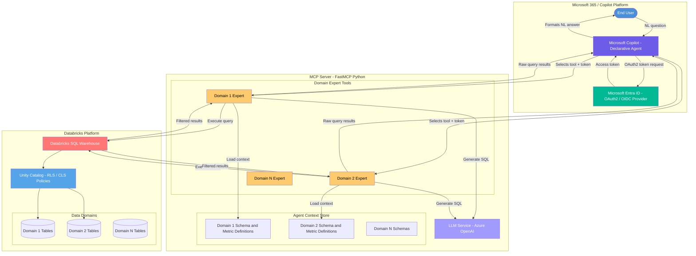
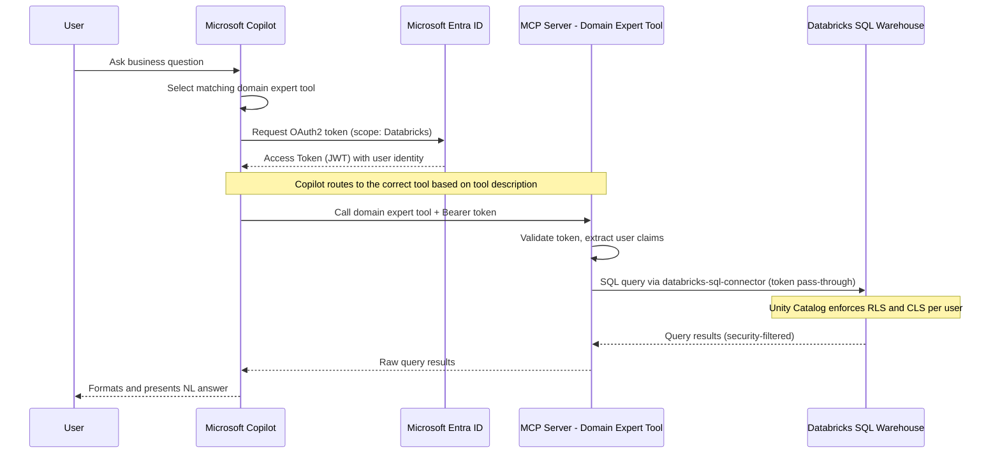
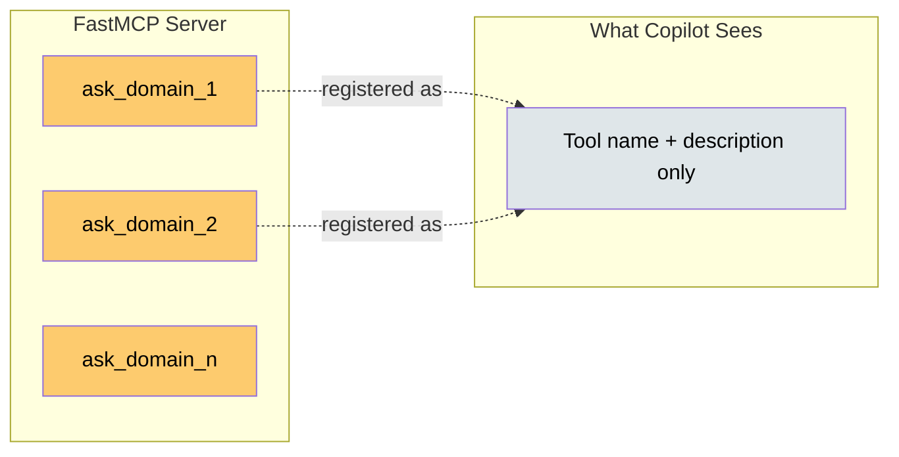
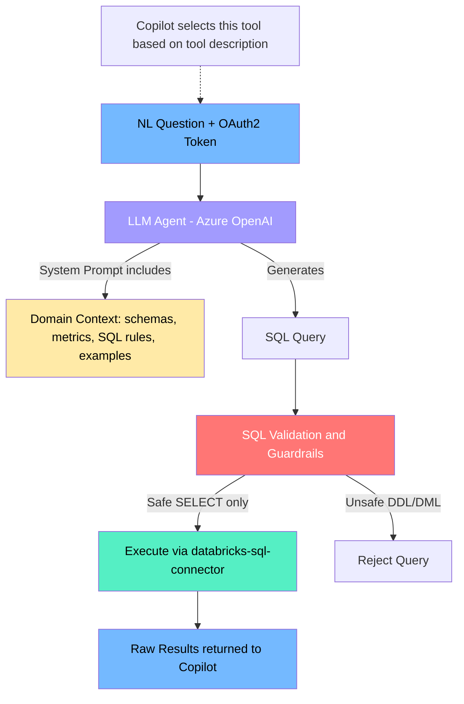
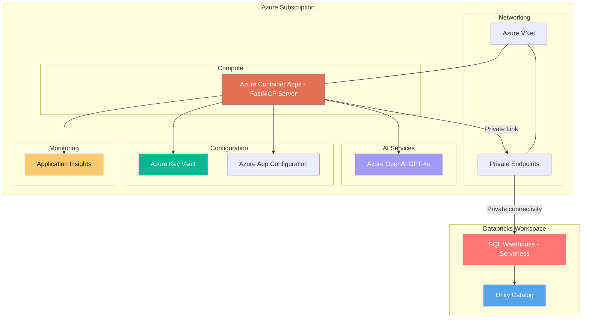

# Intelligent MCP Server for Databricks Data Intelligence

## Architecture Design Document

**Version:** 1.0  
**Date:** February 9, 2026  
**Status:** Draft

---

## 1. Executive Summary

This document describes the architecture for an **Intelligent MCP (Model Context Protocol) Server** that enables Microsoft Copilot to query Databricks SQL Warehouse using natural language. The MCP server encapsulates domain-specific LLM agents ("experts") that hold schema knowledge, business metric mappings, and query-generation logic — keeping Copilot lightweight and context-free regarding the underlying data platform.

---

## 2. Design Principles

| Principle | Description |
|---|---|
| **Separation of Concerns** | Copilot handles conversation UX and tool routing; MCP server owns data domain intelligence |
| **Domain Isolation** | Each data domain has its own expert agent (tool) with scoped context |
| **Identity Pass-Through** | User identity flows end-to-end via OAuth2; no service-account data access |
| **Security at Source** | Row-level and column-level security enforced by Databricks, not the MCP server |
| **Minimal Copilot Context** | Copilot only knows tool names and descriptions, not schemas or business logic |

---

## 3. High-Level Architecture



---

## 4. Authentication & Authorization Flow



### 4.1 Authentication Details

| Hop | Mechanism | Details |
|---|---|---|
| **User → Copilot** | Microsoft Entra ID SSO | Standard M365 authentication |
| **Copilot → MCP Server** | OAuth2 Bearer Token | Copilot sends Entra ID access token in `Authorization` header. The MCP plugin manifest declares OAuth2 auth with Databricks resource scope (`2ff814a6-3304-4ab8-85cb-cd0e6f879c1d/.default` for Azure Databricks) |
| **MCP Server → Databricks** | OAuth2 Token Pass-Through | The `databricks-sql-connector` Python SDK accepts an Entra ID access token via `access_token` parameter — no service principal needed |
| **Databricks → Data** | Unity Catalog RLS/CLS | Databricks maps the Entra ID identity to row-level and column-level security policies already configured in Unity Catalog |

### 4.2 Databricks SQL Connector

The official **`databricks-sql-connector`** Python package is the recommended connector. It supports:

- **OAuth2 token pass-through** — accepts an Entra ID (Azure AD) access token directly
- **Unity Catalog integration** — respects all governance policies
- **SQL Warehouse endpoints** — connects to serverless or classic SQL warehouses

```python
# Example: token pass-through connection
from databricks import sql

connection = sql.connect(
    server_hostname="<workspace>.azuredatabricks.net",
    http_path="/sql/1.0/warehouses/<warehouse_id>",
    access_token=user_entra_token,  # passed through from Copilot
)
```

---

## 5. MCP Server Design (FastMCP)

### 5.1 Tool Structure



### 5.2 Internal Agent Architecture (Per Expert)



### 5.3 Key Design Decisions

| Decision | Rationale |
|---|---|
| **One tool per domain** | Copilot selects the correct expert tool based on tool name and description — no routing logic in MCP server; avoids a monolithic agent overloaded with all schemas |
| **Context baked into agent system prompt** | Schema + metric definitions are static per deployment; loaded from config files at startup |
| **SQL-only (SELECT) guardrails** | The agent must never generate DDL/DML; a regex + AST validation layer enforces this |
| **Copilot formats results** | Expert tools return raw query results to Copilot, which uses its own LLM to produce a human-readable answer for the user |
| **Token pass-through, not impersonation** | The user's own Entra ID token hits Databricks, so all audit trails and security policies apply to the actual user |

---

## 6. Copilot Plugin Registration

### 6.1 MCP Server Registration in Copilot

Microsoft Copilot supports registering MCP servers as plugins. The registration includes:

1. **Plugin Manifest** — Declares available tools, their descriptions, and authentication config
2. **OAuth2 Configuration** — Specifies Entra ID as the identity provider with the Databricks resource scope
3. **Server Endpoint** — The HTTPS URL of the FastMCP server (deployed as an Azure Container App or Azure App Service)

```jsonc
// Simplified Copilot Plugin Manifest (declarative agent)
{
  "schema_version": "v1",
  "name": "business-intelligence",
  "description": "Query business data across multiple business domains",
  "auth": {
    "type": "oauth2",
    "authorization_url": "https://login.microsoftonline.com/{tenant}/oauth2/v2.0/authorize",
    "token_url": "https://login.microsoftonline.com/{tenant}/oauth2/v2.0/token",
    "scopes": "2ff814a6-3304-4ab8-85cb-cd0e6f879c1d/.default",
    "client_id": "<app-registration-client-id>"
  },
  "mcp": {
    "url": "https://business-intel-mcp.azurecontainerapps.io/mcp"
  }
}
```

### 6.2 Entra ID App Registration

| Setting | Value |
|---|---|
| **Application type** | Web |
| **Redirect URI** | Copilot's OAuth callback URL |
| **API permissions** | `Azure Databricks` → `user_impersonation` |
| **Token configuration** | Access token audience = `2ff814a6-3304-4ab8-85cb-cd0e6f879c1d` (Azure Databricks resource ID) |

---

## 7. Deployment Architecture



---

## 8. Component Summary

| Component | Technology | Purpose |
|---|---|---|
| **Copilot** | Microsoft 365 Copilot (Declarative Agent) | User-facing natural language interface |
| **Identity Provider** | Microsoft Entra ID | OAuth2/OIDC authentication, token issuance |
| **MCP Server** | FastMCP (Python) | Hosts domain expert tools (Copilot selects which tool to call) |
| **LLM Engine** | Azure OpenAI (GPT-4o / GPT-4.1) | SQL generation within domain expert tools |
| **Data Connector** | `databricks-sql-connector` (Python) | Token pass-through SQL execution |
| **Data Platform** | Databricks SQL Warehouse (Serverless) | Query execution engine |
| **Data Governance** | Databricks Unity Catalog | RLS, CLS, audit, lineage |
| **Hosting** | Azure Container Apps | Scalable, serverless MCP server hosting |
| **Secrets** | Azure Key Vault | Store non-token config (warehouse paths, etc.) |
| **Observability** | Application Insights | Request tracing, latency, error monitoring |

---

## 9. Request Lifecycle (End-to-End)

| Step | Actor | Action |
|---:|---|---|
| 1 | **User** | Asks: *"What is the business for product X in Q3?"* |
| 2 | **Copilot** | Selects the matching domain expert tool based on tool description |
| 3 | **Copilot** | Acquires Entra ID token (Databricks audience) via OAuth2 |
| 4 | **Copilot** | Calls MCP tool: `ask_domain_1(question=..., token=...)` |
| 5 | **Domain Expert Tool** | Validates token, extracts user identity |
| 6 | **Domain Expert Tool** | Loads domain schema context, sends to Azure OpenAI |
| 7 | **Azure OpenAI** | Generates: `SELECT SUM(business) FROM domain1.sales WHERE product='X' AND quarter='Q3'` |
| 8 | **Guardrail Layer** | Validates query is read-only SELECT |
| 9 | **databricks-sql-connector** | Executes query on SQL Warehouse with user's token |
| 10 | **Databricks / Unity Catalog** | Applies RLS/CLS, returns filtered results |
| 11 | **Domain Expert Tool** | Returns raw query results to Copilot |
| 12 | **Copilot** | Formats and presents NL answer to user with optional data table |

---

## 10. Security Considerations

| Area | Control |
|---|---|
| **Authentication** | OAuth2 token pass-through; no stored credentials for data access |
| **Authorization** | Enforced at Databricks via Unity Catalog RLS/CLS — MCP server does not implement its own authz |
| **Query Safety** | SQL guardrails block DDL, DML, and system catalog queries |
| **Network** | MCP server → Databricks via Azure Private Link; no public internet exposure |
| **Secrets** | Warehouse hostnames and HTTP paths in Key Vault; tokens are transient and never persisted |
| **Audit** | All queries logged in Databricks query history under the actual user identity; MCP request tracing via Application Insights |
| **Data Exfiltration** | Result-set size limits enforced in expert tools; Copilot formats the final answer for the user |

---

## 11. Extensibility

Adding a new data domain requires:

1. **Define schema context** — Create a config file with table schemas, column descriptions, and business metric mappings
2. **Register a new tool** — Add a `@mcp.tool()` function in the FastMCP server with a descriptive name and docstring
3. **Deploy** — The new tool is automatically available to Copilot after the MCP server restarts

No changes to Copilot configuration are needed — Copilot dynamically discovers tools from the MCP server.

---

## 12. Technology Choices Rationale

| Choice | Why |
|---|---|
| **FastMCP** | Lightweight Python MCP framework; simple `@mcp.tool()` decorator pattern; supports SSE and Streamable HTTP transports |
| **databricks-sql-connector** | Official Databricks Python SDK; supports OAuth2 token pass-through natively; Unity Catalog aware |
| **Azure Container Apps** | Serverless scaling; built-in ingress with TLS; VNET integration for Private Link to Databricks |
| **Azure OpenAI** | Enterprise-grade LLM; data residency compliance; managed token limits and content filtering |
| **Domain-per-tool pattern** | Avoids context window overload; each agent has focused, high-quality schema context |
