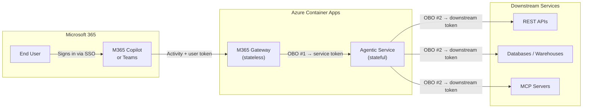
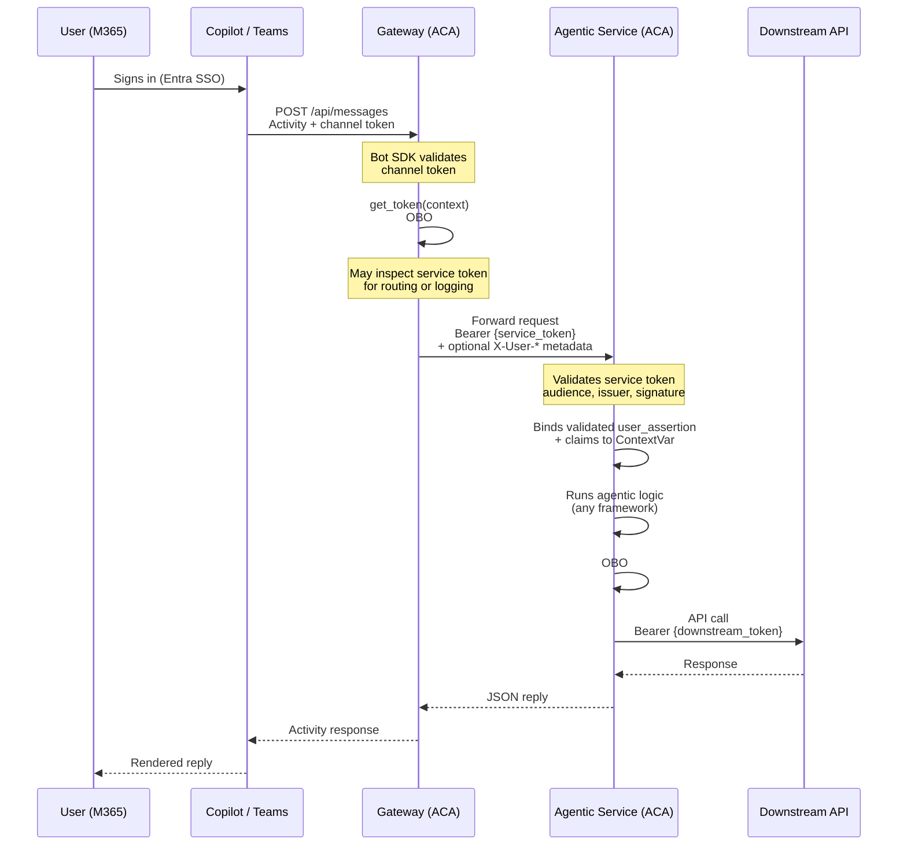
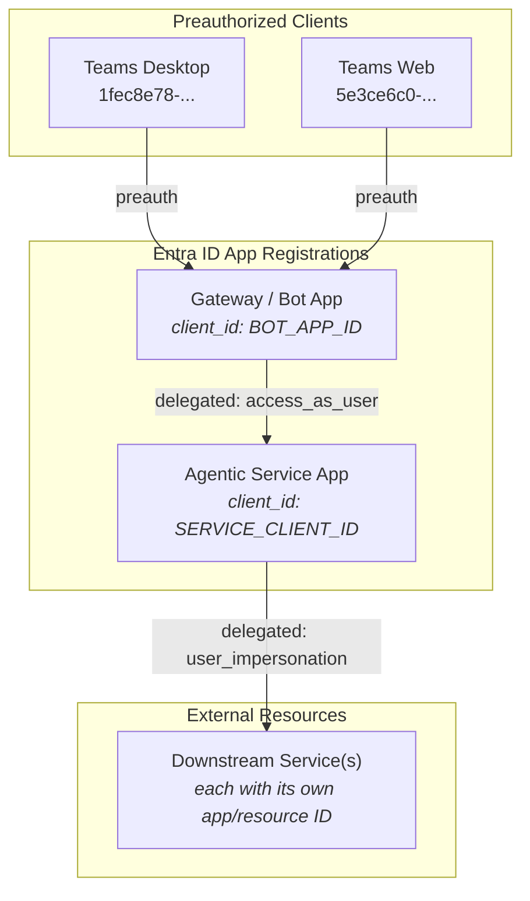
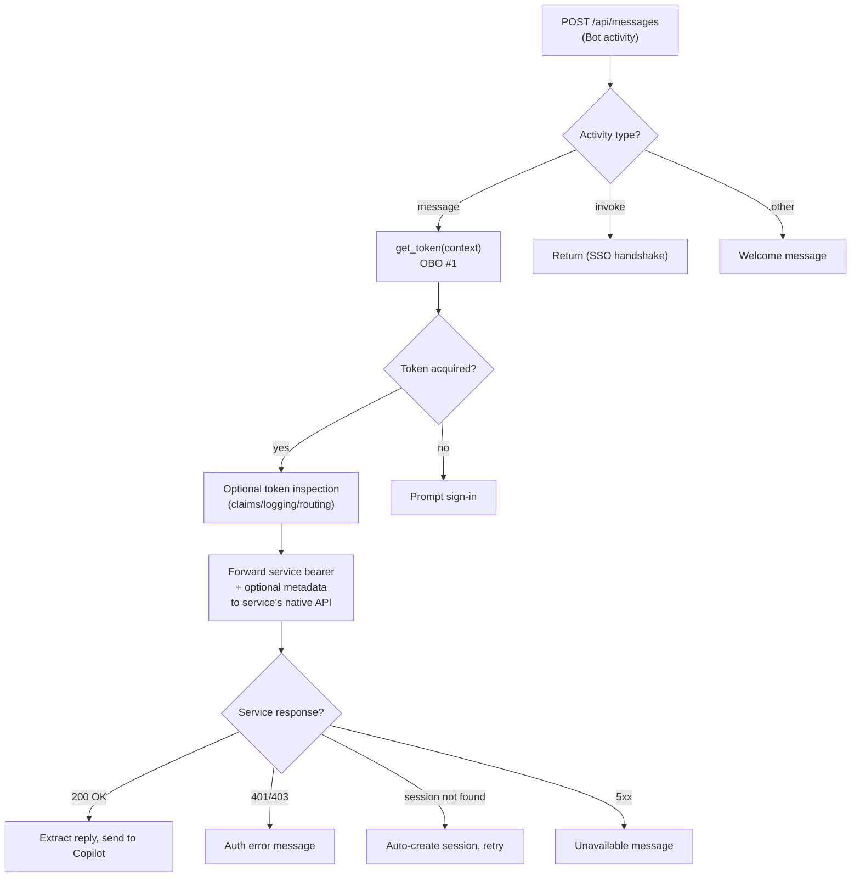
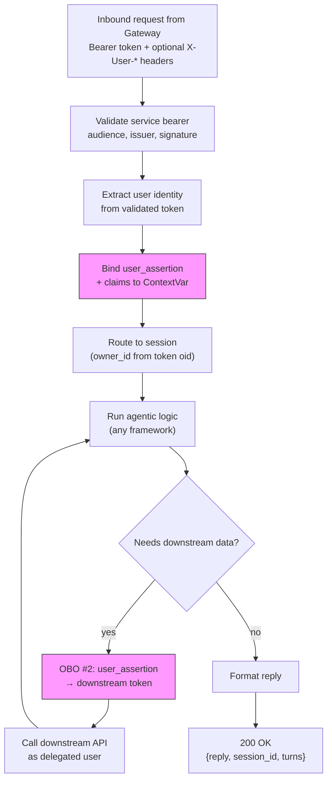
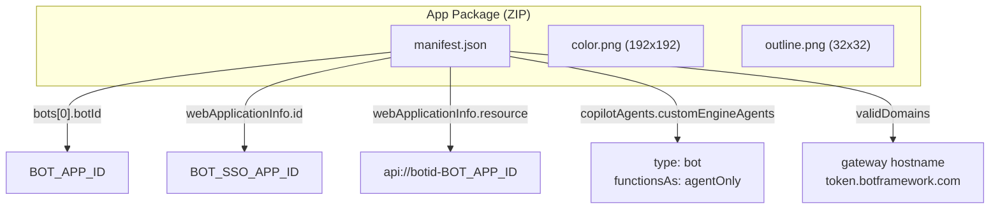
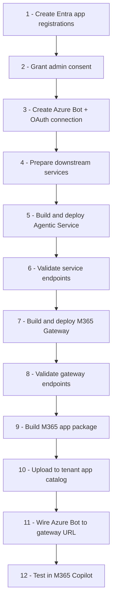
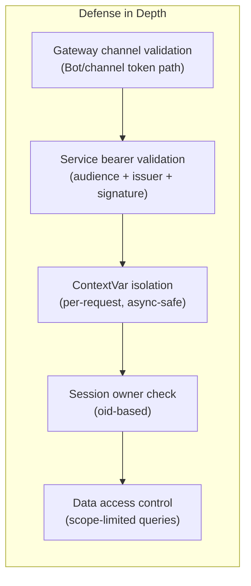

# Deploying an Agentic Service to Microsoft 365 Copilot with Delegated OBO Access

You've built an agentic service. It works. It uses the framework you chose — maybe
LangChain, maybe Semantic Kernel, maybe the Microsoft Agent Framework, maybe
something entirely your own. It talks to your LLM, calls your downstream APIs, and
manages multi-turn conversations the way you designed it.

Now someone asks: *"Can we surface this in Microsoft 365 Copilot?"*

The obvious path is to rebuild the agent using M365 Copilot Agents (declarative or
custom engine). But that means giving up control — over your orchestration logic,
your framework choices, your session management, and the way you call downstream
services on behalf of the signed-in user.

**This guide is for the other path.** The one where you keep your existing agentic
service largely intact and place an M365 Gateway in front of it — a stateless
service that handles the Bot Framework protocol, validates channel-facing tokens,
performs the first On-Behalf-Of token exchange, and translates Copilot
conversations into your service's native API. Your service can stay Bot- and
Teams-agnostic, but if it owns downstream delegated access it should still validate
the inbound service token at its own boundary and use that validated assertion for
its own OBO chain.

**When to use this pattern:**
- You have (or want to build) your own agentic implementation in your preferred
  technology and framework
- M365 Copilot Agents — declarative or custom engine — don't give you enough control
  over orchestration, tool calling, or downstream auth
- You want total ownership of the agentic logic: pro-code, your LLM, your prompts,
  your tools, your session store
- You need user-delegated access to downstream services (databases, APIs, MCP
  servers) via chained OBO flows, and you want to own that token chain end-to-end

What follows is a general development guideline — framework-agnostic, language-agnostic —
for deploying any agentic service behind Azure Container Apps, exposing it to M365
Copilot through an M365 Gateway, and using chained OBO flows to call downstream
services as the signed-in user.

---

## Architecture Overview

The architecture separates concerns into two independently deployable services:



| Layer | Responsibility | State |
|-------|---------------|-------|
| **M365 Copilot** | User identity, SSO, conversation UX | None (platform) |
| **Gateway** | Bot protocol adapter, channel auth, OBO #1 token exchange | Stateless |
| **Agentic Service** | Business logic, service-token validation, downstream OBO, session memory | Stateful |
| **Downstream** | Data, APIs, MCP servers — called as the delegated user | External |

### Why two services?

- **Separation of trust boundaries** — The gateway handles Bot Framework protocol
  and channel auth. The service owns business/data access, validates the service
  bearer it receives, and never needs Bot credentials.
- **Independent scaling** — The gateway can scale to many replicas. The service
  (with in-memory sessions) runs as a single replica for MVP.
- **Framework freedom** — The service can use any agentic framework, LLM provider,
  or custom logic. The gateway is just an HTTP forwarder.
- **Adapt without modifying** — If you already have an agentic service, you can
  bring it to M365 Copilot by writing only the gateway + service client adapter.
  The existing service stays untouched.

### How reusable is the gateway?

In practice, most of the gateway can be reused across multiple agentic services
that need to surface in M365 Copilot.

Reusable across services:

- the `POST /api/messages` host and Bot adapter bootstrap
- Bot/channel auth wiring
- OBO #1 token acquisition for the downstream service scope
- conversation ID to service session ID mapping
- long-running turn handling and delayed acknowledgement behavior
- busy-turn rejection for overlapping requests in the same conversation
- generic seller-safe auth and transient failure handling
- ACA, Azure Bot, and app-package deployment shape

Usually service-specific:

- the downstream service client
- activity-to-service payload translation
- the target service scope and app-registration values
- service-specific telemetry labels and fallback copy
- any session bootstrap contract such as `create_session()` versus direct
  first-turn POSTs

The Daily Account Planner MVP follows exactly this split: the wrapper is mostly
generic, while the planner client and a small amount of message shaping remain
service-specific.

---

## Token Flow Deep Dive

The user's identity flows end-to-end through two chained OBO exchanges. No service
ever stores or caches user passwords.



### Key principles

1. **The user token never leaves the OBO chain.** Each service receives a scoped
   assertion and exchanges it for the next hop. No service sees the original password.
2. **JWT validation is non-negotiable — and split by boundary.** The gateway must
   validate the Bot/channel-facing token it receives from Microsoft 365. The
   service must validate the inbound service-scoped bearer before using it for
   OBO, session ownership, or user scoping.
3. **Internal-only service ingress is recommended hardening, not the only safe
   option.** In ACA, private ingress is a strong default. If the service remains
   externally reachable, it must still enforce its own bearer validation and
   authorization checks exactly the same way.
4. **ContextVar carries the validated assertion.** The service binds the validated
   JWT assertion to an async-safe `ContextVar` in middleware, so any downstream
   OBO call within the same request automatically picks it up.

---

## Entra ID App Registrations

You need **two** Entra app registrations plus knowledge of your downstream API's
resource app ID.



### Step-by-step registration

#### 1. Agentic Service app

| Setting | Value |
|---------|-------|
| Display name | `your-service-api` |
| Identifier URI | `api://<service-client-id>` |
| Sign-in audience | `AzureADMyOrg` (single tenant) |
| `requestedAccessTokenVersion` | `2` |
| Exposed scope | `access_as_user` (delegated, User consent) |
| Required permissions | Downstream API `user_impersonation` (delegated) |
| Client secret | Yes — needed for MSAL ConfidentialClient OBO |

#### 2. Gateway / Bot app

| Setting | Value |
|---------|-------|
| Display name | `your-bot` |
| Identifier URI | `api://botid-<bot-client-id>` (Bot SSO convention) |
| Sign-in audience | `AzureADMyOrg` |
| `requestedAccessTokenVersion` | `2` |
| Exposed scope | `access_as_user` (delegated) |
| Required permissions | Service app `access_as_user` (delegated) |
| Redirect URI | `https://token.botframework.com/.auth/web/redirect` |
| Preauthorized clients | Teams Desktop (`1fec8e78-...`) and Teams Web (`5e3ce6c0-...`) |
| Client secret | Yes — needed for Bot Framework auth |

#### 3. Admin consent (mandatory)

Both delegated permission grants require tenant admin consent:

```
Gateway/Bot app  → Service app access_as_user       ← admin consent
Service app      → Downstream user_impersonation    ← admin consent
```

Without admin consent, OBO calls return `AADSTS65001: The user or administrator
has not consented to use the application`.

**Operational guidance:** if you package this into an operator bootstrap, treat
missing admin consent as a **blocking failure**. Do not continue with service
deployment and hope sign-in will work later. Failing fast here produces a much
more repeatable operator experience.

#### 4. Azure Bot OAuth connection

Create an OAuth connection on the Azure Bot resource so the Microsoft Agents SDK
can perform silent token exchange for the gateway-to-service hop:

```bash
az bot authsetting create \
  -g $RESOURCE_GROUP \
  -n $BOT_RESOURCE_NAME \
  -c SERVICE_CONNECTION \
  --service Aadv2 \
  --client-id $BOT_APP_ID \
  --client-secret $BOT_APP_PASSWORD \
  --provider-scope-string "$SERVICE_API_SCOPE offline_access openid profile" \
  --parameters TenantId="$TENANT_ID" TokenExchangeUrl="api://botid-$BOT_APP_ID"
```

---

## Component Implementation Guide

### Component 1: The M365 Gateway (Stateless, Protocol Adapter)

The gateway's job is to **bridge** the Bot Framework protocol into whatever HTTP
contract your agentic service exposes. It receives Bot activities, validates the
channel-facing token path, exchanges the user's SSO token for a service-scoped
token (OBO #1), and translates the call into the service's native API shape.

> **Key insight:** If you already have a stateful agentic service — even one that
> wasn't designed for M365 — the gateway can adapt to it. You do **not** need to
> modify your existing service to conform to a specific API contract. The gateway
> absorbs the M365 protocol translation. The service should still validate the
> service-scoped bearer that reaches its own API boundary.



#### Token validation responsibilities in the Gateway

> **This is a hard requirement, not optional.** The gateway is the public-facing
> trust boundary for the Bot/channel request. If channel-token validation is skipped
> or incomplete, unauthenticated callers may be able to reach your forwarding path.

The gateway must validate the Bot/channel-facing token according to the SDK/Bot
Framework requirements for the channel it serves. After OBO #1 produces a
service-scoped bearer, the gateway may inspect that token for diagnostics,
routing, or optional metadata forwarding, but the service must remain the
authoritative validator for that service token.

Good gateway behavior:

1. **Validate inbound channel traffic** using the Bot/Agents SDK middleware or
   equivalent issuer/signature/audience checks for the incoming channel token
2. **Acquire the service-scoped token** for your service API with OBO #1
3. **Forward the service bearer as-is** in `Authorization: Bearer ...`
4. **Optionally extract claims** for logging or convenience headers:
   - `oid` (user object ID)
   - `tid` (tenant ID)
   - `upn` or `preferred_username`
5. **Treat forwarded headers as non-authoritative metadata**. They can help with
   telemetry, correlation, or debugging, but the service should derive identity
   from the validated bearer it receives.

#### Adapting to your service's API contract

The gateway contains a **service client** — a small HTTP adapter class that
translates between the Copilot conversation model and your service's native API.
This is where you map:

| Copilot concept | Your service's equivalent | Mapped in the service client |
|----------------|--------------------------|------------------------------|
| `conversation.id` | Session/thread/chat ID | Map on create or first message |
| User message text | Request body field (could be `text`, `message`, `prompt`, `input`, etc.) | Reshape the request payload |
| Reply text | Response field (could be `reply`, `response`, `output`, `content`, etc.) | Extract from response payload |
| Authentication | Bearer token, API key, or custom header | Attach the service-scoped delegated token in the right header/field |

**Example: adapting to different service shapes**

```python
# Service client for a service with POST /chat/{thread_id}
class MyServiceClient:
    async def send_turn(self, session_id: str, text: str, token: str) -> str:
        resp = await self.http.post(
            f"{self.base_url}/chat/{session_id}",
            json={"prompt": text, "stream": False},
            headers={"Authorization": f"Bearer {token}"},
        )
        return resp.json()["response"]  # extract from service's response shape

# Service client for a service with POST /v1/conversations/{id}/messages
class AnotherServiceClient:
    async def send_turn(self, session_id: str, text: str, token: str) -> str:
        resp = await self.http.post(
            f"{self.base_url}/v1/conversations/{session_id}/messages",
            json={"content": text, "role": "user"},
            headers={"X-Api-Token": token},
        )
        return resp.json()["choices"][0]["message"]["content"]
```

The gateway message handler remains the same regardless of the service client shape:

```python
async def handle_message(context):
    token = await agent_auth.get_token(context)
    session_id = context.activity.conversation.id
    reply = await service_client.send_turn(session_id, context.activity.text, token)
    await context.send_activity(reply)
```

#### What the gateway needs from any service

As long as the service supports these three capabilities — in whatever API shape — the
gateway can adapt to it:

1. **Session/thread identity** — Some way to maintain conversation state across turns
   (session ID, thread ID, conversation ID, etc.)
2. **Message exchange** — An endpoint that accepts user text and returns a reply
3. **Authentication** — Accepts a bearer token or other credential that the gateway
   can supply via OBO #1

The service does **not** need to use a specific URL pattern, request/response schema,
or framework. The gateway's service client class is the single place where you encode
these mappings. The service should still validate the bearer it receives before it
trusts any user identity implied by the call.

#### Key implementation details

**Auth handlers** — The gateway needs two auth handler paths:

- **Agentic path** (`AgenticUserAuthorization`): Used when the activity arrives
  through the M365 Copilot agentic channel. Requires both `abs_oauth_connection_name`
  and `obo_connection_name`.
- **Connector path** (`UserAuthorization`): Used when the activity arrives through
  standard Teams / Bot connector. Requires `abs_oauth_connection_name` only.

```python
auth_handlers = {
    "service_agentic": AuthHandler(
        auth_type="AgenticUserAuthorization",
        abs_oauth_connection_name="SERVICE_CONNECTION",
        obo_connection_name="SERVICE_OBO_CONNECTION",   # may be same as abs
        scopes=["api://<service-client-id>/access_as_user"],
    ),
    "service_connector": AuthHandler(
        auth_type="UserAuthorization",
        abs_oauth_connection_name="SERVICE_CONNECTION",
        obo_connection_name="",
        scopes=["api://<service-client-id>/access_as_user"],
    ),
}
```

**Invoke handling** — Copilot sends `invoke` activities during the SSO token exchange
handshake. The gateway must handle these gracefully (return without error) or the
sign-in flow breaks.

**Session mapping** — Use `context.activity.conversation.id` as the session key when
forwarding to the service. This ensures the same Copilot conversation always maps
to the same agentic session.

**Healthz bypass** — The ACA health probe hits `/healthz`. Bypass JWT middleware for
this path or the probe fails.

**Long-running compatibility bridge** — If the SDK's built-in long-running
proactive path does not preserve the message contract your wrapper needs, keep
long-running mode enabled but own a very small gateway-local compatibility
bridge. That bridge should preserve the original user message activity while
still using the proactive continuation context for the outbound reply. Keep this
as an infrastructure concern in the gateway; do not move business logic there.

#### Technology choices

The gateway uses:
- `microsoft-agents-hosting-fastapi` for the Bot SDK adapter
- `microsoft-agents-authentication-msal` for MSAL-based token exchange
- `httpx` for forwarding HTTP calls to the service

You can substitute any Bot SDK or language as long as you handle the same protocol.

---

### Component 2: The Agentic Service (Stateful, Framework-Agnostic)

The service is a regular HTTP API. It can know nothing about Bot Framework, Teams,
or Copilot-specific activity shapes, but if it owns downstream delegated access it
should validate the inbound service bearer at its own boundary. It receives the
service-scoped token, validates it, binds user claims from that validated token,
runs your agentic logic, and returns a reply.

> **Service trust model:** The service is the business/data trust boundary. It should
> trust the validated bearer token it receives, not convenience headers alone.
> Forwarded `X-User-*` headers are optional metadata and should never be the sole
> basis for user scoping or downstream OBO.



#### Minimum service requirements

The service needs only these capabilities — everything else is optional:

| Requirement | What it means | Why |
|-------------|--------------|-----|
| **Validate inbound bearer** | Read and validate the `Authorization: Bearer` header | Needed before using the token for OBO, ownership, or authorization |
| **Extract claims from the validated token** | Decode `oid`, `tid`, `upn` / `preferred_username`, scopes, etc. | Needed for session owner isolation and audit trail |
| **Session/thread identity** | Maintain conversation state across turns | Copilot expects multi-turn conversations |
| **Message exchange** | Accept user text, return a reply | Core function |
| **OBO #2** (if user-delegated access needed) | MSAL `acquire_token_on_behalf_of()` with the forwarded assertion | Only if calling downstream APIs as the user |
| **Ingress hardening** | Prefer internal-only ingress or equivalent network controls when practical | Reduces attack surface, but does not replace service-side token validation |

#### ContextVar pattern for the OBO assertion

The validated JWT assertion (the raw token string from the gateway) must be available
deep in the call stack when a downstream OBO call happens — potentially several
layers below the HTTP handler. Use `contextvars.ContextVar` rather than passing it
through every function signature:

```python
from contextvars import ContextVar, Token as CtxToken

_USER_ASSERTION: ContextVar[str | None] = ContextVar("user_assertion", default=None)
_USER_CLAIMS: ContextVar[TokenClaims | None] = ContextVar("user_claims", default=None)

def bind_identity(assertion: str, claims: TokenClaims):
    return _USER_ASSERTION.set(assertion), _USER_CLAIMS.set(claims)

def reset_identity(a_tok: CtxToken, c_tok: CtxToken):
    _USER_ASSERTION.reset(a_tok)
    _USER_CLAIMS.reset(c_tok)

# In middleware, after validating the bearer:
a_tok, c_tok = bind_identity(raw_jwt, validated_claims)
try:
    response = await call_next(request)
finally:
    reset_identity(a_tok, c_tok)  # always clean up
```

**Why ContextVar?** — It is async-safe (each concurrent request gets its own scope),
framework-agnostic (works with FastAPI, Flask, Django, raw asyncio), and avoids
threading the assertion through your entire agentic stack.

#### OBO #2 to downstream services

When your agentic logic needs to call a downstream API as the user:

```python
import msal

app = msal.ConfidentialClientApplication(
    client_id=SERVICE_CLIENT_ID,
    client_credential=SERVICE_CLIENT_SECRET,
    authority=f"https://login.microsoftonline.com/{TENANT_ID}",
)

result = app.acquire_token_on_behalf_of(
    user_assertion=_USER_ASSERTION.get(),          # from ContextVar
    scopes=["<downstream-resource-id>/.default"],  # e.g. Graph, Databricks, your own API
)
downstream_token = result["access_token"]
```

Common downstream scope examples:

| Downstream | Scope |
|-----------|-------|
| Microsoft Graph | `https://graph.microsoft.com/.default` |
| Azure Databricks | `2ff814a6-3304-4ab8-85cb-cd0e6f879c1d/.default` |
| Azure SQL | `https://database.windows.net/.default` |
| Custom internal API | `api://<their-app-id>/.default` |
| MCP server behind Entra | `api://<mcp-app-id>/.default` |

The pattern is identical for any Entra-protected resource — only the scope changes.

#### Session management

Minimum viable session store for MVP (in-memory, single-replica):

- **Create** — `POST /api/chat/sessions` → returns `session_id`
- **Send message** — `POST /api/chat/sessions/{id}/messages` → returns `reply`
- **Get session** — `GET /api/chat/sessions/{id}` → returns turns history
- **Owner isolation** — Every session has an `owner_id` from the validated JWT
  `oid` claim. Reject cross-user access with 403.
- **Turn windowing** — Cap stored turns at `max_turns * 2` entries to prevent
  unbounded memory growth.
- **Concurrency lock** — `asyncio.Lock()` per session prevents interleaved turns.

#### Your agentic logic goes here

The service API is a clean boundary. Inside it, use whatever you want:

- **Microsoft Agent Framework** — HandoffBuilder, ConcurrentBuilder, etc.
- **LangChain / LangGraph** — chains, graphs, tool calling
- **Semantic Kernel** — planners and plugins
- **Custom code** — direct OpenAI / Azure OpenAI SDK calls with tool loops
- **Any other framework** — CrewAI, AutoGen, etc.

#### Reference API contract

If building a new service from scratch, this contract works well with the gateway:

```
POST /api/chat/sessions/{session_id}/messages
Authorization: Bearer <service-scoped-token>
Content-Type: application/json
{"text": "user message"}

→ 200 {"session_id": "...", "reply": "...", "turns": [...]}
→ 401 (bad/missing token)
→ 404 (session not found — gateway auto-creates and retries)
```

However, if you have an **existing service** with a different contract, you do not
need to change it. Instead, adapt the gateway's service client to speak your
service's API (see [Component 1: The M365 Gateway](#component-1-the-m365-gateway-stateless-protocol-adapter)
above). The three essential capabilities are session identity, message exchange, and
authentication — the URL paths and payload shapes are flexible.

---

### Component 3: The M365 App Package

The app package is a ZIP containing a manifest and icons that registers the gateway
as a Custom Engine Agent in Microsoft 365.



#### Critical manifest fields

```json
{
  "bots": [{
    "botId": "<BOT_APP_ID>",
    "scopes": ["personal"]
  }],
  "webApplicationInfo": {
    "id": "<BOT_SSO_APP_ID>",
    "resource": "api://botid-<BOT_APP_ID>"
  },
  "copilotAgents": {
    "customEngineAgents": [{
      "type": "bot",
      "id": "<BOT_APP_ID>",
      "functionsAs": "agentOnly"
    }]
  },
  "validDomains": [
    "<gateway-host>.azurecontainerapps.io",
    "token.botframework.com"
  ]
}
```

---

## Deployment Sequence

Follow this exact order. Each step depends on the previous outputs.



**Step details:**

| Step | What | Depends on |
|------|------|------------|
| 1 | Create service app + bot app in Entra ID | Tenant access |
| 2 | Grant admin consent for both delegated permission chains | Step 1 |
| 3 | Create Azure Bot resource, configure OAuth connection (`SERVICE_CONNECTION`) | Steps 1-2 |
| 4 | Provision downstream resources (databases, APIs, warehouses) | Independent |
| 5 | Build container image, deploy Agentic Service to ACA | Steps 1-4 |
| 6 | Validate `/healthz`, session creation, first turn, OBO to downstream | Step 5 |
| 7 | Build container image, deploy M365 Gateway to ACA | Steps 1-3, 5 |
| 8 | Validate `/healthz`, gateway-to-service forwarding | Steps 6-7 |
| 9 | Build manifest.json + icons into ZIP package | Steps 1, 7 |
| 10 | Upload ZIP to Microsoft 365 admin center or Graph API | Step 9 |
| 11 | Set Azure Bot messaging endpoint to `https://<gateway>/api/messages` | Steps 3, 7 |
| 12 | Open M365 Copilot, send a message, verify end-to-end flow | Steps 10-11 |

### Operatorized bootstrap variant

For a reusable customer/operator flow, this pattern works better when it is
packaged into **two main scripts** plus **two-layer env files**:

1. **Operator input env**
   - small, human-edited
   - contains only the initial tenant/subscription/resource naming values and
     any demo-user identities
2. **Generated runtime env**
   - script-owned
   - stores discovered URLs, app IDs, secrets, package IDs, and image refs

Recommended split:

1. `bootstrap-azure-demo.sh`
   - preflight Azure login and permissions
   - create or reuse infra
   - create/reuse app registrations
   - enforce admin-consent success
   - build and publish images
   - deploy the service and the gateway
   - wire Azure Bot and OAuth connection
2. `bootstrap-m365-demo.sh`
   - build the Teams/M365 app package
   - publish to the tenant catalog
   - self-install for the signed-in operator

This keeps the operator surface area small while preserving advanced lower-level
scripts for recovery or debugging.

### Environment variables reference

#### Agentic Service

| Variable | Example | Purpose |
|----------|---------|---------|
| `AZURE_TENANT_ID` | `b5d67878-...` | Entra tenant (for OBO #2) |
| `SERVICE_CLIENT_ID` | `<service-app-id>` | Service app registration (for OBO #2) |
| `SERVICE_CLIENT_SECRET` | `<secret>` | Service OBO client credential |
| `DOWNSTREAM_OBO_SCOPE` | `<resource-id>/.default` | Downstream resource scope for OBO #2 |
| `AZURE_OPENAI_ENDPOINT` | `https://....cognitiveservices.azure.com` | LLM endpoint |
| `AZURE_OPENAI_DEPLOYMENT` | `gpt-4o` | Model deployment name |
| `DATABRICKS_WAREHOUSE_ID` | `warehouse-123` | Optional fixed warehouse id if already known |
| `DATABRICKS_AUTO_CREATE_WAREHOUSE` | `true` | Allow bootstrap to create a warehouse when none exists |

#### M365 Gateway

| Variable | Example | Purpose |
|----------|---------|---------|
| `AZURE_TENANT_ID` | `b5d67878-...` | Entra tenant |
| `BOT_APP_ID` | `<bot-app-id>` | Bot registration |
| `BOT_APP_PASSWORD` | `<secret>` | Bot client secret |
| `SERVICE_BASE_URL` | `https://my-service.azurecontainerapps.io` | Service endpoint |
| `SERVICE_API_SCOPE` | `api://<service-app-id>/access_as_user` | OBO #1 target scope |
| `SERVICE_EXPECTED_AUDIENCE` | `api://<service-app-id>` | JWT audience validation |

### Repeatability guidance

If you expect operators to rerun the deployment in the same working copy:

- keep operator-owned inputs separate from generated runtime values
- persist app IDs/object IDs after first create and prefer those on reruns
- avoid re-identifying Entra apps by display name alone
- bind the generated runtime env to a signature of the operator inputs so a new
  tenant, subscription, or prefix does not inherit stale values from an old run
- prefer early preflight failures over deep runtime failures

---

## Security Checklist



- [ ] **Gateway channel auth enforced** — Bot/channel-facing traffic is validated before forwarding
- [ ] **Service JWT audience validated** — Service rejects tokens with wrong `aud`
- [ ] **Service JWT issuer validated** — Service accepts only the intended tenant STS URIs
- [ ] **Service JWT signature verified** — RS256 via JWKS endpoint, not hardcoded keys
- [ ] **Service ingress hardened** — Prefer internal-only or restricted ingress where practical
- [ ] **ContextVar reset in finally block** — Prevents assertion leaking across requests
- [ ] **Session owner isolation** — `owner_id` from validated `oid` claim, 403 on mismatch
- [ ] **Downstream data access scoped** — Use parameterized queries, canned operations,
  or row-level security; avoid exposing raw query interfaces to the agent
- [ ] **Secrets stored securely** — Client secrets as ACA secrets (`secretref:`), not
  plain env vars
- [ ] **Health endpoint unauthenticated** — `/healthz` bypasses JWT middleware
- [ ] **Invoke activities handled** — Gateway returns cleanly for SSO handshake invokes
- [ ] **Admin consent granted** — Both OBO permission chains have tenant admin consent

---

## Common Pitfalls and Troubleshooting

| Symptom | Cause | Fix |
|---------|-------|-----|
| `AADSTS65001: not consented` | Missing admin consent for delegated permissions | Grant admin consent for both OBO chains |
| `The provided token is not exchangeable` | Bot OAuth connection misconfigured or stale SSO cache | Recreate OAuth connection; open a new Copilot conversation |
| OBO #2 returns `invalid_grant` | User assertion expired or audience mismatch in service app | Ensure `requestedAccessTokenVersion: 2` and correct audience |
| Gateway returns 401 to Copilot | Gateway channel auth or wrapper token acquisition fails | Verify Bot/channel auth config and gateway auth handler wiring |
| Service returns 401/403 to gateway | Service bearer validation rejects the forwarded token | Verify `SERVICE_EXPECTED_AUDIENCE`, issuer, tenant, and signing key refresh logic |
| Deployment succeeds partway but M365 sign-in still fails | App registration permissions were created but admin consent was not actually granted | Treat consent as blocking, rerun only after consent succeeds |
| Session 403 on second turn | Session `owner_id` doesn't match the validated token `oid` on the follow-up turn | Verify the same signed-in user is present and the service derives ownership from the validated bearer, not mutable forwarded headers |
| `/healthz` returns 401 | Health endpoint not excluded from auth middleware | Add path exclusion for `/healthz` |
| Invoke activities show error to user | Missing invoke handler in gateway | Add a no-op route for `activity.type == "invoke"` with `is_invoke=True` |
| Fresh workspace fails during first query or seed | No SQL warehouse exists yet | Auto-create a starter warehouse during bootstrap or require an explicit warehouse id in preflight |

---

## Extending the Pattern

### Adding a new downstream service

Whether the downstream is a REST API, a database (SQL, Cosmos DB), an MCP server,
or a SaaS platform — the OBO pattern is identical as long as the resource is
protected by Entra ID:

1. Add a delegated permission to the service app registration for the new resource
2. Grant admin consent
3. Add a new `acquire_X_access_token()` function using the same ContextVar assertion
   with the new resource's scope (e.g., `https://graph.microsoft.com/.default`)
4. Call it from your agentic logic when the new downstream is needed

Common scenarios:

- **REST APIs** — Call with `Bearer` token in the `Authorization` header
- **Databases** (Azure SQL, Databricks, Cosmos DB) — Use the OBO token as the auth
  credential for the database client or connection string
- **MCP servers** — If the MCP server is behind Entra, pass the OBO token; if it uses
  a different auth scheme, exchange or bridge the credential as needed
- **Microsoft Graph** — OBO to `https://graph.microsoft.com/.default` for user
  profile, mail, calendar, files, etc.

### Fronting an existing agentic service

If you already have a working agentic service that was not designed for M365:

1. **Keep the service contract stable where possible.** Its API contract, session
   model, and agentic runtime can usually stay as-is. If it does not already
   validate the service bearer, add that at the service boundary before relying
   on delegated downstream access.
2. **Create the gateway** with a service client class that maps Copilot conversations
   to your service's session model, reshapes message payloads, and attaches the OBO
   token in whatever form the service expects. The gateway also handles channel
   auth and may forward user claims as optional metadata headers.
3. **Prefer restricted ingress for the service** so it is not broadly exposed.
   This is recommended hardening, but not a substitute for service-side bearer
   validation.
4. **Register the Entra apps** as described above. The service app's `access_as_user`
   scope is what the gateway's OBO #1 targets. If the service already has an Entra
   app registration, add the `access_as_user` scope and preauthorize the bot app.
5. **If the service calls downstream APIs** and needs user-delegated access, have it
   validate the forwarded Bearer token and use that validated assertion as the
   `user_assertion` for OBO #2.
   If the service uses API keys or managed identity for downstream calls (not
   user-delegated), OBO #2 is not needed.

This approach lets you bring any agentic service — regardless of framework, language,
or hosting — to M365 Copilot by writing only the gateway layer.

### Scaling beyond single-replica

Replace the in-memory session store with Redis, Cosmos DB, or another distributed
store. The ContextVar + OBO pattern is unaffected — it's per-request, not
per-replica.

### Adding a second Copilot-facing agent

Deploy a second gateway + service pair. Each gets its own app registrations and
Bot resource. The M365 app package can declare multiple bots or you can publish
separate packages.
