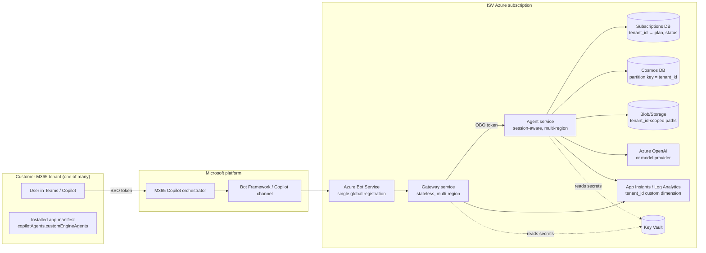

# Multi-Tenant ISV Architecture: Agent Service for M365 Copilot via AppSource

**Audience:** ISV architects building an agentic service that is hosted in the ISV's own Azure subscription, distributed through the Microsoft AppSource / Microsoft 365 Commercial Marketplace, installed by customer admins into their M365 tenants, and surfaced inside Microsoft 365 Copilot as a Custom Engine Agent (CEA).

**Scope:** The agent service uses the ISV's own data (publisher-owned), which may be partitioned per customer tenant. This document is intentionally generic — no assumption about a specific data platform, agent framework, or vertical use case.

**Companion document:** [`m365-agentic-service-developer-guide.md`](./m365-agentic-service-developer-guide.md) covers the protocol-level mechanics (Entra app registrations, manifest fields, OBO token exchange, OAuth connection setup). This document focuses on the architectural choices that are unique to the multi-tenant SaaS scenario; it cross-references rather than duplicates that material.

---

## 1. Executive summary

You (the ISV) operate a single agent service in your own Azure subscription. Many customer tenants install your M365 app from AppSource. Each user interacts with your agent inside Copilot, and every request must be:

- **Identified** — you must know which user in which tenant is asking.
- **Authorized** — you must verify that the user's tenant has an active subscription and that the user is entitled to the feature.
- **Isolated** — data you return must come only from that tenant's partition; cross-tenant leakage is the worst-case incident.
- **Observable** — telemetry, billing, and incident response must be tenant-attributed end-to-end.

The architecture that satisfies this with the least moving parts is:

- **Identity:** multi-tenant Entra app registrations (gateway + service), validated by `tid` against your subscription database. Tokens flow Copilot → gateway → service via OAuth 2.0 On-Behalf-Of.
- **Compute:** stateless gateway in front of a stateful agent service, both in *your* subscription. One Bot Service registration globally; one logical service deployment per region.
- **Data:** publisher-owned Cosmos DB (or equivalent multi-tenant store) partitioned by `tenant_id`. Tenant ID is enforced at the data-access layer, not trusted from request bodies.
- **Distribution:** AppSource SaaS offer with Microsoft 365 Certification. Per-tenant lifecycle driven by AppSource webhooks (subscribe / unsubscribe / change plan).
- **Billing:** Marketplace-managed subscription for seat/flat pricing; Marketplace metering API for usage-based charges.

Everything else in this document is the rationale, the trade-offs, and the things that are easy to get wrong.

---

## 2. Architecture overview



**Key topology choices (and why):**

| Decision | Choice | Reason |
|---|---|---|
| Bot Service registrations | **One** global registration, multi-tenant Entra app | Bot identity = your app's identity to Microsoft. One identity → one registration. Per-tenant registration would not scale and is not how AppSource works. |
| Service instances | **Stateless gateway + stateful service** | Lets you scale the channel-facing layer independently and keeps long-running agent state pinned. The split also matches the auth boundary cleanly. |
| Regions | **Per-region deployment, tenant pinned at provisioning** | Data residency promises (EU customers stay in EU) and latency. Cross-region routing is acceptable for stateless gateway, not for the agent service. |
| Data store | **Cosmos DB (or equivalent), partitioned by `tenant_id`** | Hierarchical partitioning (`/tenant_id/...`) gives you per-tenant logical isolation, per-partition throughput, and clean delete semantics for offboarding. |
| Per-tenant DB? | **No, shared store with strong partitioning** | Operational cost of N databases dominates well before you hit Cosmos partition limits. Use a per-tenant database only if a customer contractually requires physical isolation. |

---

## 3. Identity and access model

### 3.1 The two app registrations you actually need

Both live in *your* tenant. Their `signInAudience` differs and the difference matters:

| App reg | `signInAudience` | Why |
|---|---|---|
| **Gateway / bot app** — registered with Bot Service. Copilot exchanges the user's SSO token for a token whose `aud` = this app. | **`AzureADMultipleOrgs` (multi-tenant)** — required. Without this, no customer tenant can have a service principal of your app and no token can be issued. |
| **Service app** — represents the agent service API. The gateway calls it via OBO. Exposes scopes like `access_as_user`. | **`AzureADMyOrg` (single-tenant) is usually sufficient.** Wire it up with `knownClientApplications: [<gateway-app-id>]` and pre-authorize the gateway for `access_as_user`. The customer tenant can then mint OBO tokens whose `aud` = your single-tenant service app, because the gateway is the client and OBO inherits the user's tenant context. |

Flip the **service app** to multi-tenant only when:
- A non-gateway client in the customer tenant (their own script, Power Platform connector, custom app) needs to call your API directly, or
- You want a separate consent surface for service-app scopes that isn't bundled with the gateway's consent.

For the M365 Copilot CEA pattern where the gateway is the only client, single-tenant service app is the cleaner default — fewer objects in customer tenants, fewer audit surfaces.

### 3.1.1 What admin consent actually grants

When a customer admin hits `/adminconsent?client_id=<gateway-app>&tenant=<their-tenant>`, two things happen in their tenant T:

1. **A service principal of your gateway app is created in T.** Your app reg lives in your tenant; the service principal is the local "shadow" in theirs. Without this object, token requests fail with `AADSTS650051` ("application not found in directory").
2. **The delegated permissions your app declared get pre-approved at tenant scope** — so individual users don't see consent prompts on first use (which they often can't approve anyway in regulated tenants).

**The minimum permission set for the gateway app:**

| Permission | Type | Purpose |
|---|---|---|
| `openid`, `profile`, `email`, `offline_access` | Delegated | OIDC basics; required to issue an SSO token at all. |
| `User.Read` (Microsoft Graph) | Delegated | Read the calling user's identity claims (UPN, oid, name). |
| `api://<service-app>/access_as_user` | Delegated | Lets the gateway request OBO tokens for your service API on behalf of the user. **This is the one that makes the architecture work.** |

That's the floor. Add Graph permissions (`Mail.Read`, `Files.Read`, `Calendars.Read`) only if your agent actually reads the user's M365 data. **Avoid application-type permissions (`User.Read.All`, `Directory.Read.All`) unless you genuinely need them** — they get scrutinized hard during admin review and during M365 Certification, and they often delay deals.

### 3.2 Token flow

```
M365 Copilot
  │  (1) issues SSO token for user U in tenant T, audience = your gateway app
  ▼
Gateway
  │  (2) validates: signature, issuer = T, aud = gateway, tid = T
  │  (3) checks T is in subscriptions table with status = active
  │  (4) MSAL OBO: assertion = SSO token → token for service-app audience
  ▼
Agent service
  │  (5) validates: aud = service-app, tid = T, scope contains access_as_user
  │  (6) extracts (tenant_id, user_oid, upn) and binds them to a request context
  │  (7) every downstream call includes tenant_id; data layer rejects calls without it
```

**Things to enforce, not assume:**

- The token's `tid` is the *only* trustworthy source of tenant identity. Never read `tenant_id` from a request body or query string and treat it as identity.
- Token validation must accept *any* `tid` (because the gateway is multi-tenant) but must reject any `tid` not in your active-subscriptions table. "Multi-tenant" does not mean "anyone with an Entra account."
- Pin the issuer authority to `https://login.microsoftonline.com/{tid}/v2.0` per request (not the `common` endpoint at validation time). This prevents accepting tokens that signed using common-endpoint metadata.
- Cache JWKS per tenant with bounded TTL.
- Note: the OBO step produces a token whose `tid = T` regardless of whether the service app is single- or multi-tenant. `tid` reflects the user's home tenant; `aud` reflects the service app. Don't confuse the two when validating.

### 3.3 Three patterns for downstream data access

Pick deliberately; you may need more than one.

| Pattern | When to use | Auth |
|---|---|---|
| **Publisher-owned, partitioned by tenant** | The default for this document. ISV stores tenant data in its own Cosmos / SQL / Blob. | Service uses MI; data layer enforces `WHERE tenant_id = ctx.tenant_id`. |
| **Customer-owned, OBO into their tenant** | You need to pull from the user's own M365 / Graph / their data lake. | Second OBO hop from service-app token to e.g. Microsoft Graph. The token now has the user's permissions in their tenant. |
| **Shared third-party (Bing, weather, news, etc.)** | Non-tenant-specific external APIs. | ISV service principal / API key. Cost attribution still happens via tenant context in app code. |

For the publisher-owned pattern, the auth is simple but the **enforcement is the hard part** — see §6.

### 3.4 If a customer uses a different identity provider

The Copilot → gateway leg is locked to Entra; you do not get to change that. The downstream half is yours:

- If you OBO into the customer's tenant for Graph, you're already using their Entra (because their M365 is in Entra). No change needed.
- If your downstream resources are in a non-Entra system (Okta, Auth0, AWS Cognito), federate or bridge: your service swaps the Entra-issued token for a token in the downstream system based on a tenant-scoped mapping. Document this clearly; it is a common source of "why does this user get 403?" incidents.

---

## 4. Tenant lifecycle

### 4.1 Provisioning (subscribe)

```
Customer admin → AppSource purchase
  → Marketplace fires SubscribeWebhook → your provisioning endpoint
  → admin lands on your provisioning page (mandatory per Marketplace rules)
  → admin grants admin consent to your multi-tenant app
  → you create row in subscriptions table:
     { tenant_id, plan, status=active, created_at, region, contact_email }
  → you create the tenant's data partition lazily on first request, or eagerly here
```

You **must** handle the case where admin consent and subscription happen in either order, and where consent is revoked before the subscription is canceled (and vice versa). Always treat the subscription record as the authority on "is this tenant active right now?"

### 4.2 Configuration (per tenant)

Avoid forking code per tenant. Drive everything from configuration:

- Feature flags (`features.account_pulse = true`)
- Model selection (`model.default = gpt-4o-mini`, `model.premium = gpt-4o`)
- Brand / white-label fields (display name, logo URL)
- Quotas (`limits.requests_per_user_per_day = 200`)
- Data-source toggles per the three patterns in §3.3

Store in a `tenant_config` document keyed by `tenant_id`. Cache aggressively in the service with explicit invalidation on admin updates.

### 4.3 Deconsent / cancellation

- Marketplace fires UnsubscribeWebhook → flip `subscriptions.status = canceled`.
- Token validation in §3.2 step 3 starts rejecting all requests immediately.
- After contractual retention window (commonly 30–90 days), purge tenant data partition. This is much easier with a partition-key delete than with cross-table cascades.
- Customer admin can also revoke consent in their portal at any time. Your app keeps existing if they later re-consent; users will hit consent prompts in the meantime.

### 4.4 Migration / DR

- Per-region deployments mean cross-region failover should be exercised, not assumed.
- Have a runbook for "move tenant T from region X to region Y" (admin-initiated). It will be requested.

---

## 5. Component design

### 5.1 Gateway (stateless)

Responsibilities:
- Bot Framework adapter (receive Copilot activity, send back).
- Token validation #1 (Copilot → gateway).
- OBO exchange to service-app audience.
- Long-running message handling (ack within seconds; stream / interim updates).
- Idempotency on Bot Framework retries.

Non-responsibilities: no business logic, no data access, no per-tenant state. This lets you horizontally scale the gateway to handle channel chatter.

### 5.2 Agent service (session-aware)

Responsibilities:
- Token validation #2 (gateway → service).
- Tenant resolution + subscription gate.
- Session store (per-conversation context, agent memory).
- Agent orchestration (planner, tool calls, model invocation).
- Data-layer access enforcing tenant scoping.

Statefulness implications:
- If the session store is in-memory, pin the conversation to the same replica or accept session loss on restart.
- If the session store is in Cosmos, partition by `tenant_id` + `conversation_id` and you can scale horizontally.

### 5.3 Background workers (optional)

Many agentic services need offline work: precomputing daily briefings, embedding generation, scheduled scans. Run these as a separate service (Container Apps Job, AKS CronJob, Functions). They:

- Authenticate with managed identity, not user OBO.
- Iterate over `subscriptions WHERE status = active`.
- Write into the same partitioned data store with the same tenant scoping.
- Emit telemetry with the same `tenant_id` custom dimension as the live path.

### 5.4 What does NOT belong in any of the above

- Per-tenant code branches (`if tenant_id == "Acme": ...`). Use config.
- Per-tenant container images. Use config.
- Per-tenant secrets in code. Use Key Vault references keyed by tenant_id where the secret really differs.

---

## 6. Data architecture

### 6.1 Partition strategy

Whatever store you use, the rule is:

> **Tenant ID is the leading partition key, period.**

Cosmos: `/tenant_id` or hierarchical `/tenant_id/entity_type`. SQL: `tenant_id` as the first column of every clustered index. Blob: container-per-tenant or `tenant_id/...` prefix with SAS scoped to the prefix.

### 6.2 Enforcement

The riskiest line of code in the entire system is one that queries the data store *without* a tenant_id filter. Defenses, in order of strength:

1. **No raw store access from agent code.** All access goes through a repository / data-access layer that takes a `RequestContext` (which carries `tenant_id`) as a non-optional parameter.
2. **The repository injects the tenant_id filter unconditionally.** It is impossible from the call site to forget it because the call site never specifies it.
3. **Tests verify cross-tenant queries return empty.** Seed two tenants; query as tenant A; assert zero rows from tenant B. Run on every PR.
4. **At-rest defense in depth:** customer-managed keys per tenant if a customer requires it; otherwise platform-managed keys are sufficient for most.

### 6.3 Schema evolution

- All schema changes must be backward compatible for at least one release.
- Migrations run per-tenant, idempotent, and resumable.
- Never run a migration that touches all tenant partitions simultaneously without rate-limiting; you will trip Cosmos RU limits or DB pool exhaustion.

### 6.4 Backups and retention

- Backup at the store level (e.g., Cosmos continuous backup) rather than per-tenant export. Per-tenant restore is then a partition-scoped restore operation.
- Document RPO / RTO per region in your customer-facing trust documentation. Customers will ask.
- Retention after offboarding: codify the window (30 / 60 / 90 days), automate purge, and log the purge event with the tenant_id for audit.

---

## 7. Hosting and networking

### 7.1 Azure resource layout (recommended baseline)

Per region:

- 1 × Resource Group `rg-{app}-{region}-prod`
- 1 × Container Apps Environment (or AKS cluster) hosting gateway and service
- 1 × Cosmos DB account (multi-region write if you need active-active)
- 1 × Key Vault
- 1 × Storage account
- 1 × App Insights / Log Analytics workspace
- 1 × Azure OpenAI resource (capacity-pinned per region)

Global:

- 1 × Bot Service registration (channel registration is global)
- 1 × Subscriptions DB (low-volume, can be in your "home" region with read replicas elsewhere if needed)
- 1 × Front Door / Traffic Manager for region routing of the gateway endpoint

### 7.2 Networking

- Private endpoints for Cosmos, Key Vault, Storage, OpenAI.
- Container Apps Environment in a VNet with NAT egress for predictable outbound IPs (some customers will ask for an allowlist).
- Bot Service ingress is public by necessity (Microsoft has to reach you), but the gateway should reject anything that isn't a properly signed Bot Framework activity from the Microsoft service principal.

### 7.3 Scaling

- Gateway: scale on RPS. Stateless, so concurrency is straightforward.
- Service: scale on RPS but with affinity if session store is in-memory. Cap max replicas to your worst-case AOAI TPM divided by per-replica peak draw, otherwise you create your own throttling incident.
- Background workers: scale on queue depth or scheduled fan-out, not on count of active tenants. A "one worker per tenant" model is a footgun.

---

## 8. Per-tenant configuration

A single config schema, validated at load time, with per-tenant overrides:

```yaml
# defaults
features:
  account_pulse: true
  deal_coach: false
limits:
  requests_per_user_per_day: 200
model:
  default: gpt-4o-mini

# tenant overrides (in tenant_config doc)
tenants:
  "Acme-tenant-id":
    features:
      deal_coach: true
    limits:
      requests_per_user_per_day: 1000
    model:
      default: gpt-4o
```

Resolved as `defaults ⊕ tenant_overrides` at request time, cached for the request's duration.

White-label scope tends to balloon. Constrain it: display name and logo URL only, unless a contractual obligation demands more. Tenant-specific prompts are a slippery slope toward N forks of your agent's behavior.

---

## 9. Observability

The single most important enrichment is `tenant_id` as a custom dimension on **every** log, metric, trace, and exception. Without it, your incident response degenerates into "is this affecting one tenant or all of them?" guessing.

Recommended:

- **App Insights** with custom dimensions: `tenant_id`, `user_oid_hash`, `region`, `feature`, `model`, `request_id`, `conversation_id`, `git_sha`.
- **Per-tenant SLOs** on key metrics: p95 latency, error rate, model token consumption.
- **Tenant-scoped dashboards** so support can pivot quickly during an incident call.
- **PII discipline**: hash UPN/oid before logging unless you have legal basis to log them in clear. `tenant_id` is fine; user identity needs care.
- **Bake `git_sha` into the image** (env var + OCI label + `/version` endpoint) so an alert can be tied unambiguously to a build.

---

## 10. Security and compliance

### 10.1 Token validation rigor

In addition to §3.2:
- Reject tokens with `appid` / `azp` not on an allowlist (Copilot, Test in Web Chat, your local debug client).
- Reject tokens older than your replay window (5 minutes is a reasonable default after clock skew).
- Treat `iss` mismatch as a hard failure, not a warning.

### 10.2 Tenant isolation

Adopt §6.2 enforcement and run a periodic cross-tenant audit job: pick two random tenants, attempt to read each other's data with each tenant's identity, and alert if anything comes back. This is your canary against a regression in the data layer.

### 10.3 Secrets

- All secrets in Key Vault. No secrets in app config, env files committed to git, or container images.
- Bot AAD client secret default lifetime is 24 months; this is the **#1 silent breakage** for production agents. Set a 90-day expiry alert and an automated rotation runbook.
- Rotate signing keys, encryption keys, and storage keys on a calendar. Tie rotation to deployments, not "when we remember."

### 10.4 Audit

Append-only audit log of: subscribe / unsubscribe events, admin config changes, cross-region tenant moves, data exports, deletions. Retain ≥ 1 year. Customers under SOC 2 will ask for this.

### 10.5 Data residency

- Region pinning at provisioning is the simplest model. "EU tenants stay in EU" is enforceable when there's no cross-region replication of `tenant_id`-keyed data.
- If you offer a "global" tier, document the regions data may traverse. Customers in regulated industries will read this.

### 10.6 Microsoft 365 Certification

Required for AppSource listing in many scenarios; expect a **4–12 week** review cycle. Plan it as part of GA, not as an afterthought. The Microsoft Cloud App Security questionnaire is exhaustive; pre-fill it from your existing SOC 2 / ISO 27001 evidence if you have it.

---

## 11. Billing and metering

Three Marketplace-supported models; pick one or combine:

| Model | Mechanism | Use when |
|---|---|---|
| **Flat-rate SaaS** | Marketplace SaaS subscription | Simple "per tenant per month." Lowest operational overhead. |
| **Per-seat** | Marketplace SaaS subscription with seat plans | Sales motion is per-user. Customer admin manages seat assignments in their portal. |
| **Usage-metered** | Marketplace metering API + emit usage events from your service | You want to charge for tokens, requests, or feature use. |

Even with flat-rate, **emit per-tenant usage telemetry** so you can:
- Identify customers approaching plan limits (upsell signal).
- Identify abusive patterns (rate-limit before they become a cost incident).
- Make pricing decisions based on real distribution, not guesses.

The metering API is fire-and-forget but you must reconcile rejections. Keep a 7-day buffer of unsent events with retry.

---

## 12. Operational model

### 12.1 Deployment

- One container image, many tenants. Tag with short SHA: `myapp-service:abc1234`.
- Promote through environments: dev → staging → prod, with a **tenant-pinned canary** in prod (e.g., your own internal tenant) before broad rollout.
- Path-filtered CI: gateway changes don't redeploy the service and vice versa.
- Manual gate before prod.

### 12.2 Rollback

- Image-tag swap, not redeployment from source.
- DB migrations are forward-only and backward-compatible; rollback is "redeploy old image, leave schema."

### 12.3 Incident response

- Page on tenant-scoped error rate spikes, not just global.
- Have a "disable feature for tenant X" lever (config flag) that does not require deployment.
- Have a "freeze tenant X writes" lever (read-only mode) for data-corruption scenarios.

### 12.4 Tenant offboarding

A scheduled job, not a manual ticket. Triggered by `subscriptions.status = canceled` plus retention window elapsed. Logs the tenant_id, partition stats, and final purge count to the audit log.

---

## 13. Reference deployment topology and MVP path

The full picture in §2–§12 is the *destination*. To get to a paying customer in a defensible way without building everything first:

**Phase 1 — single-tenant private preview**
- Multi-tenant app reg, but only your own tenant consents.
- Single region, no Front Door.
- In-memory session store, pinned to one replica.
- Cosmos with `tenant_id` partition key from day one (don't retrofit this).
- Subscriptions table with one row.
- App Insights with `tenant_id` dimension on every log.

**Phase 2 — design partner (2–5 tenants)**
- Provisioning page + admin consent flow live.
- Subscribe webhook handler in place; status gate in token validation.
- Per-tenant config schema in use, even if all tenants use defaults.
- Cross-tenant isolation tests in CI.

**Phase 3 — AppSource general availability**
- Microsoft 365 Certification submitted in parallel with hardening.
- Metering API integration if usage-priced.
- Multi-region (at least one EU + one US).
- Background worker layer, with tenant-iteration discipline.
- Runbooks: incident, rotation, region migration, offboarding.

**Phase 4 — scale**
- Active-active multi-region for the agent service.
- Customer-managed keys for regulated verticals.
- Per-tenant white-label, only as far as contracts demand.

---

## 14. Risks and trade-offs

| Risk | Likelihood | Mitigation |
|---|---|---|
| Cross-tenant data leak | Low if §6.2 followed; catastrophic if not | Repository pattern, no raw store access, automated cross-tenant audit job. |
| AOAI TPM exhaustion under load spike from one tenant | High | Per-tenant rate limits *plus* per-region capacity headroom. PTU for top tenants. |
| Bot AAD secret expiry in production | Very high if not automated | 90-day alert, automated rotation, multiple valid secrets during rotation window. |
| Microsoft 365 Certification slips your GA | High | Start in parallel with build, not after. Pre-write the questionnaire. |
| Token from a non-subscribed tenant slips through | Medium | `tid` allowlist + subscription status gate at every request. Test with tokens from a tenant not in your subscriptions table. |
| Per-tenant "small" customizations multiply | Very high (organizational, not technical) | Strict config schema, hard "no" on per-tenant code paths. |
| One tenant's bad config breaks all tenants | Medium | Config schema validation on write; per-tenant config never blocks other tenants' requests. |
| "Move tenant from region A to region B" requested for the first time on a Friday | High | Build the runbook before you need it, ideally in Phase 2. |

---

## Appendix: Decisions worth reconsidering only with strong reason

- **One Bot Service registration globally.** Not per region, not per customer.
- **Multi-tenant Entra apps, never per-customer app registrations.**
- **`tenant_id` as a leading partition key everywhere.** Not a column you filter on; a partition key.
- **Repository pattern for all data access.** Not "rules we follow"; an architecture that makes the wrong thing hard.
- **Stateless gateway + stateful service split.** Even if your "gateway" is initially trivial, the boundary pays back when scaling and auditing.
- **Region pinning at provisioning.** Cross-region tenant data movement is an exceptional event, not a routine one.
- **Config-driven, not code-driven, per-tenant variation.** Every per-tenant `if` block is a future support ticket.
