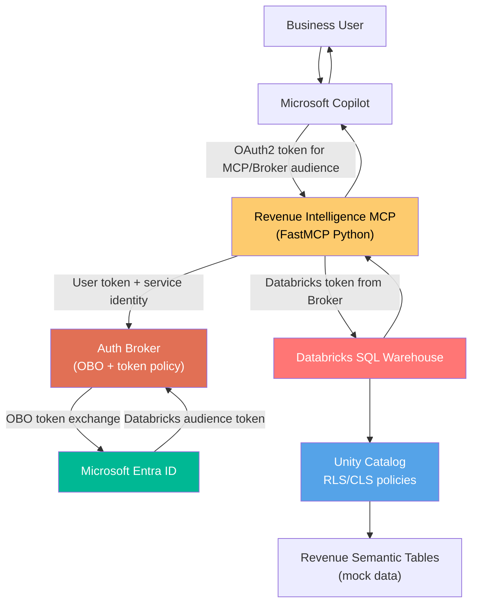
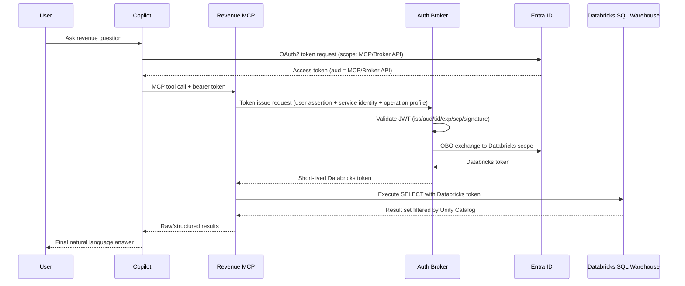

# Revenue Intelligence MCP with Auth Broker (No APIM)

## POC Architecture Design Document

**Version:** 1.0  
**Date:** March 5, 2026  
**Status:** Proposed MVP / POC

---

## 1. Purpose

This document defines a **POC architecture** for Revenue Intelligence with:

- Microsoft Copilot + MCP integration
- A shared **Auth Broker** using OAuth2 On-Behalf-Of (OBO)
- **No API Management (APIM)** to reduce implementation complexity
- Azure Databricks SQL Warehouse with Entra ID + Unity Catalog
- Mocked revenue reporting data with regional data-access controls
- A semantic data model that represents business metrics and concepts

This builds on the original architecture while simplifying the deployment path for fast validation.

---

## 2. MVP Scope

### 2.1 In Scope

- One MCP service: `Revenue Intelligence MCP`
- One Auth Broker service for token validation + OBO exchange
- One Databricks SQL Warehouse for query execution
- Unity Catalog governance with region-based data controls
- Two Entra groups for RLS behavior validation
- Mock data set for business reporting use cases

### 2.2 Out of Scope (POC)

- APIM gateway policies and productization
- Multi-tenant support
- Enterprise-scale CI/CD and DR setup
- Non-SQL Databricks APIs (Jobs, Model Serving) execution in this phase

---

## 3. Target Architecture (POC)



---

## 4. Component Responsibilities

| Component | Responsibility |
|---|---|
| **Copilot** | User conversation and MCP tool invocation |
| **Revenue Intelligence MCP** | Domain prompt orchestration, SQL generation guardrails, result shaping |
| **Auth Broker** | Validate inbound user token, enforce policy, perform OBO to Databricks audience |
| **Entra ID** | OAuth2/OIDC token issuance and OBO token exchange |
| **Databricks SQL Warehouse** | Execute SQL queries |
| **Unity Catalog** | Enforce row-level/column-level data access policy |
| **Semantic Tables** | Represent real business entities, dimensions, and metrics |

---

## 5. Authentication and Authorization Flow (No APIM)



### 5.1 Why this is simpler for MVP

- No APIM deployment or policy layer in the first phase.
- Direct service-to-service integration between MCP and Broker.
- Auth complexity is centralized in Broker (not duplicated in MCP logic).

---

## 6. Databricks Security Model for POC

### 6.1 Entra User Groups (Regional Access)

- `grp_revenue_na`: users can access North America rows only
- `grp_revenue_emea`: users can access EMEA rows only

### 6.2 Data Access Pattern

Use a region mapping + secure view (or Unity Catalog row filter policy) so query results are filtered by user/group context.

Example POC approach:

- Base fact table contains all regions.
- Secure view applies `current_user()` lookup through a principal-to-region mapping table.

---

## 7. Semantic Data Model (Mock Revenue)

The model uses a compact star schema with business-friendly dimensions and metric definitions.

### 7.1 Core Tables

- `dim_date` (fiscal attributes, calendar hierarchy)
- `dim_region` (region, country, sales geography)
- `dim_product` (product family, SKU, category)
- `dim_customer` (segment, tier, account attributes)
- `dim_sales_channel` (direct, partner, online)
- `fact_revenue` (bookings, recognized revenue, discount, units)
- `fact_quota` (targets/quota by period, region, product)
- `metric_catalog` (business metric semantic definitions)

### 7.2 Example Business Metrics

- **Gross Revenue** = `SUM(gross_amount)`
- **Net Revenue** = `SUM(net_amount)`
- **ARR** = `SUM(arr_amount)`
- **Discount %** = `SUM(discount_amount) / NULLIF(SUM(gross_amount),0)`
- **Attainment %** = `SUM(net_amount) / NULLIF(SUM(quota_amount),0)`
- **YoY Growth %** = `(Revenue_t - Revenue_t-1) / Revenue_t-1`

### 7.3 Semantic Benefits for MCP

- MCP prompts can reference business concepts (ARR, attainment, segment, region) rather than raw columns.
- Metric formulas and guardrails are explicit and reusable.
- SQL generation quality improves due to stable dimensional semantics.

---

## 8. Mock Data and Security DDL (POC Template)

```sql
-- 1) Catalog / schema
CREATE CATALOG IF NOT EXISTS ri_poc;
CREATE SCHEMA IF NOT EXISTS ri_poc.revenue;

-- 2) Dimensions
CREATE OR REPLACE TABLE ri_poc.revenue.dim_region (
  region_id STRING,
  region_code STRING,
  region_name STRING,
  country STRING
);

CREATE OR REPLACE TABLE ri_poc.revenue.dim_product (
  product_id STRING,
  product_family STRING,
  product_name STRING
);

CREATE OR REPLACE TABLE ri_poc.revenue.dim_date (
  date_key DATE,
  fiscal_year INT,
  fiscal_quarter STRING,
  month_name STRING
);

CREATE OR REPLACE TABLE ri_poc.revenue.metric_catalog (
  metric_code STRING,
  metric_name STRING,
  metric_formula STRING,
  metric_grain STRING,
  metric_owner STRING
);

-- 3) Facts
CREATE OR REPLACE TABLE ri_poc.revenue.fact_revenue (
  date_key DATE,
  region_id STRING,
  product_id STRING,
  customer_segment STRING,
  gross_amount DECIMAL(18,2),
  discount_amount DECIMAL(18,2),
  net_amount DECIMAL(18,2),
  arr_amount DECIMAL(18,2),
  units INT
);

CREATE OR REPLACE TABLE ri_poc.revenue.fact_quota (
  date_key DATE,
  region_id STRING,
  product_id STRING,
  quota_amount DECIMAL(18,2)
);

-- 4) Seed dimensions and semantic metric definitions
INSERT INTO ri_poc.revenue.dim_region VALUES
  ('R1', 'NA', 'North America', 'United States'),
  ('R2', 'EMEA', 'Europe, Middle East and Africa', 'Germany');

INSERT INTO ri_poc.revenue.dim_product VALUES
  ('P1', 'Data Platform', 'Analytics Pro'),
  ('P2', 'AI Add-on', 'Predictive Insights');

INSERT INTO ri_poc.revenue.dim_date VALUES
  (DATE '2026-01-15', 2026, 'Q1', 'January'),
  (DATE '2026-02-15', 2026, 'Q1', 'February');

INSERT INTO ri_poc.revenue.metric_catalog VALUES
  ('gross_revenue', 'Gross Revenue', 'SUM(gross_amount)', 'region,product,time', 'RevenueOps'),
  ('net_revenue', 'Net Revenue', 'SUM(net_amount)', 'region,product,time', 'RevenueOps'),
  ('arr', 'Annual Recurring Revenue', 'SUM(arr_amount)', 'region,product,time', 'RevenueOps'),
  ('attainment_pct', 'Attainment Percent', 'SUM(net_amount)/NULLIF(SUM(quota_amount),0)', 'region,product,time', 'RevenueOps');

-- 5) Seed facts for two regions
INSERT INTO ri_poc.revenue.fact_revenue VALUES
  (DATE '2026-01-15', 'R1', 'P1', 'Enterprise', 120000.00, 12000.00, 108000.00, 95000.00, 42),
  (DATE '2026-01-15', 'R2', 'P1', 'Enterprise', 90000.00, 9000.00, 81000.00, 70000.00, 31),
  (DATE '2026-02-15', 'R1', 'P2', 'Mid-Market', 60000.00, 3000.00, 57000.00, 48000.00, 55),
  (DATE '2026-02-15', 'R2', 'P2', 'Mid-Market', 50000.00, 4000.00, 46000.00, 39000.00, 49);

INSERT INTO ri_poc.revenue.fact_quota VALUES
  (DATE '2026-01-15', 'R1', 'P1', 115000.00),
  (DATE '2026-01-15', 'R2', 'P1', 85000.00),
  (DATE '2026-02-15', 'R1', 'P2', 58000.00),
  (DATE '2026-02-15', 'R2', 'P2', 47000.00);

-- 6) Principal-to-region mapping used by secure view
CREATE OR REPLACE TABLE ri_poc.revenue.principal_region_access (
  principal STRING,
  region_code STRING
);

-- 7) Seed region access for two groups (example principal names)
INSERT INTO ri_poc.revenue.principal_region_access VALUES
  ('grp_revenue_na', 'NA'),
  ('grp_revenue_emea', 'EMEA');

-- 8) Secure view for row-level region filtering
CREATE OR REPLACE VIEW ri_poc.revenue.v_fact_revenue_secure AS
SELECT f.*
FROM ri_poc.revenue.fact_revenue f
JOIN ri_poc.revenue.dim_region r ON f.region_id = r.region_id
JOIN ri_poc.revenue.principal_region_access a ON a.region_code = r.region_code
WHERE is_account_group_member(a.principal);
```

> Note: In production, prefer formal Unity Catalog row filter policies and managed identity/group governance patterns. This secure-view approach is suitable for POC speed.

---

## 9. MCP Service Design for POC

### 9.1 Tools

- `ask_revenue_intelligence(question: str)`

### 9.2 MCP Runtime Steps

1. Receive user question and Copilot bearer token.
2. Validate input shape and perform SQL safety checks.
3. Request Databricks token from Broker (`operation_profile = sql.read.revenue`).
4. Generate SQL against semantic objects (`v_fact_revenue_secure`, dimensions, quota).
5. Execute read-only SQL in Databricks SQL Warehouse.
6. Return raw tabular result + metric metadata to Copilot.

### 9.3 Guardrails

- SELECT-only SQL allowlist.
- Block DDL/DML and non-approved schemas.
- Result row limits (for example, max 5,000 rows).
- Timeout and retry controls for query calls.

---

## 10. Broker API Contract (POC)

### 10.1 Token Issue Endpoint

`POST /broker/v1/databricks/token`

Request:

```json
{
  "user_assertion": "<incoming_user_access_token>",
  "operation_profile": "sql.read.revenue",
  "workspace": "ri-dbx-workspace",
  "warehouse_id": "<sql_warehouse_id>"
}
```

Response:

```json
{
  "access_token": "<short_lived_databricks_token>",
  "expires_in": 900,
  "token_type": "Bearer"
}
```

### 10.2 Minimum Broker Validations

- User token signature and issuer
- Audience is MCP/Broker API
- Tenant allowlist
- Required scope present
- MCP service identity allowlist
- Operation profile allowlist

---

## 11. POC Deployment Topology

- **Revenue MCP**: Azure Container Apps (or App Service)
- **Auth Broker**: Azure Container Apps (or App Service)
- **Secrets/Certs**: Azure Key Vault
- **Telemetry**: Application Insights
- **Data Plane**: Databricks SQL Warehouse + Unity Catalog

No APIM in POC. Introduce APIM in phase 2 for centralized ingress, quotas, and API lifecycle governance.

---

## 12. Validation Plan (POC Success Criteria)

### 12.1 Functional Tests

- Copilot user in `grp_revenue_na` sees only NA revenue data.
- Copilot user in `grp_revenue_emea` sees only EMEA revenue data.
- Core metric questions return expected numeric outputs (Net Revenue, ARR, Attainment).

### 12.2 Security Tests

- Invalid audience token is rejected by Broker.
- Expired token is rejected.
- MCP cannot request unauthorized operation profiles.

### 12.3 Observability Tests

- Correlation ID appears across MCP logs, Broker logs, and Databricks query history.
- Auth failures are traceable with actionable error reason codes.

---

## 13. Next Step After POC

- Add APIM for enterprise ingress/policy standardization.
- Extend operation profiles to Databricks Jobs and Model Serving.
- Promote secure-view RLS to formal Unity Catalog row filter policies.
- Add automated semantic regression tests for NL-to-SQL quality.

---

## 14. Implementation Blueprint (for Build Execution)

### 14.1 Planned Repository Layout

```text
poc/
  README.md
  .env.example
  infra/
    main.bicep
    main.bicepparam
    outputs.md
  scripts/
    setup-app-registrations.ps1
    seed-databricks-revenue.sql
    deploy-poc.ps1
    run-e2e-tests.ps1
  services/
    auth-broker/
      app/main.py
      app/config.py
      app/security.py
      requirements.txt
      Dockerfile
    revenue-mcp/
      app/server.py
      app/sql_guardrails.py
      app/databricks_client.py
      app/broker_client.py
      requirements.txt
      Dockerfile
  tests/
    test_sql_guardrails.py
    test_broker_contract.py
    e2e/
      e2e_revenue_queries.ps1
```

### 14.2 Service Contracts

- **Broker Token API**: `POST /broker/v1/databricks/token`
  - Input: user assertion, operation profile, workspace/warehouse hints
  - Output: short-lived Databricks access token and expiry
- **MCP Tool**: `ask_revenue_intelligence(question: str)`
  - Input: natural language question + user bearer token from Copilot
  - Output: structured table rows + metric metadata + query trace id

### 14.3 Runtime Configuration

- Auth Broker configuration
  - Entra tenant id
  - Broker app client id
  - Broker credential source (client secret/certificate)
  - Databricks resource scope (`2ff814a6-3304-4ab8-85cb-cd0e6f879c1d/.default`)
  - Allowed operation profiles
- Revenue MCP configuration
  - Broker base URL
  - Azure OpenAI endpoint/model/deployment
  - Databricks SQL hostname/http path
  - Query limits and timeout controls

### 14.4 Build and Rollout Phases

1. **Bootstrap Infrastructure**
   - Create container apps environment, managed identities, logging resources, and app configs.
2. **Configure Identity**
   - Create app registrations, exposed scopes, delegated permissions, and admin consent.
3. **Deploy Services**
   - Build/push images for broker and MCP, deploy to Container Apps.
4. **Load Semantic Mock Data**
   - Create tables/views and regional principal mappings in Databricks SQL.
5. **Run End-to-End Tests**
   - Validate group-based data filtering, metric correctness, and auth failure paths.

### 14.5 POC Exit Criteria

- Copilot can call MCP endpoint with OAuth2 and receive valid responses.
- Auth Broker successfully performs OBO and returns Databricks token.
- NA and EMEA users receive different result sets from same question.
- At least 5 canonical business questions return expected metrics.
- Logs show traceable correlation across MCP, Broker, and Databricks query history.

---

## 15. Implementation Findings (March 2026)

The following findings were validated during live MCP client interoperability testing.

### 15.1 MCP endpoint and discovery conventions

- Use `/mcp` as the canonical streamable HTTP endpoint.
- Publish OAuth protected resource metadata from the root host path (`/.well-known/oauth-protected-resource`).
- Keep discovery URL rooted at service base URL; do not use `/mcp` as the discovery URL.

### 15.2 FastMCP runtime integration requirements

- When mounting FastMCP in FastAPI, the parent app must use FastMCP lifespan to initialize task groups correctly.
- Stateless streamable HTTP is required for clients that do not maintain MCP session IDs consistently.

### 15.3 Broker audience validation behavior

- Inbound user token audience validation must accept practical audience variants used by real clients.
- Broker configuration can provide comma-separated expected audiences; broker logic should normalize app-ID and `api://` forms to avoid false-negative `401` outcomes.

### 15.4 Operational outcome

- End-to-end tool execution was validated from MCP client through broker OBO exchange into Databricks SQL and returned expected structured results.
