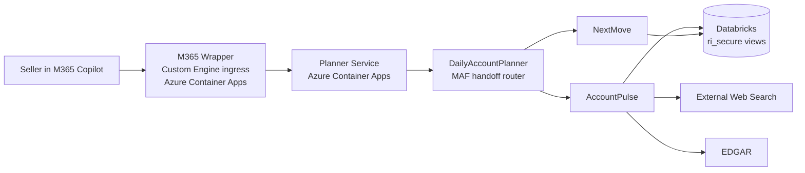
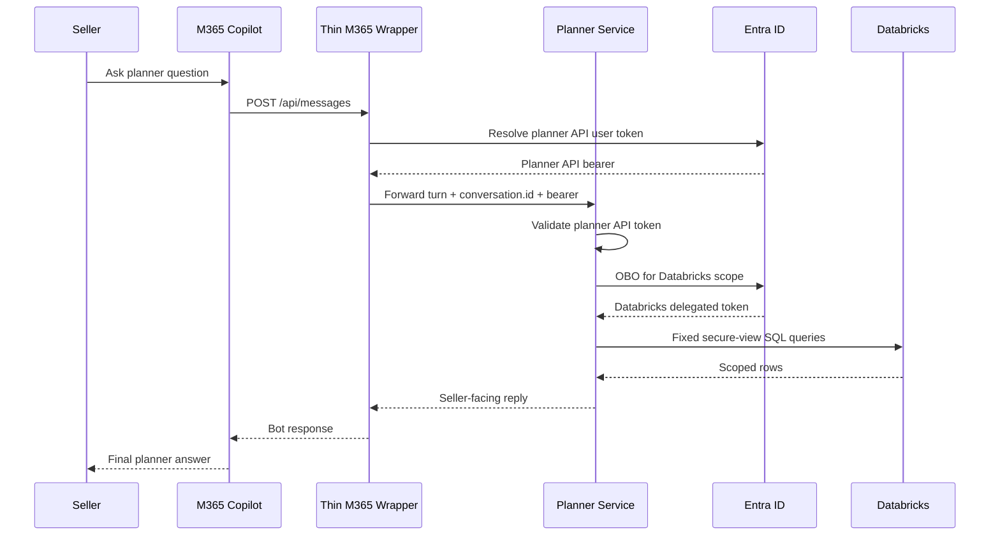
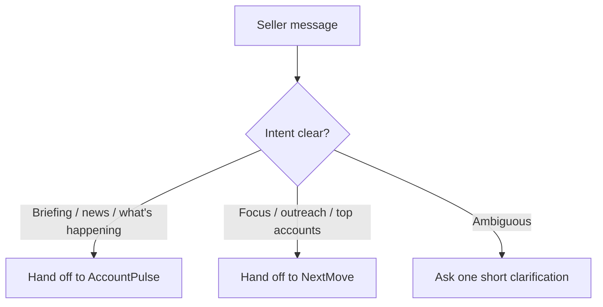
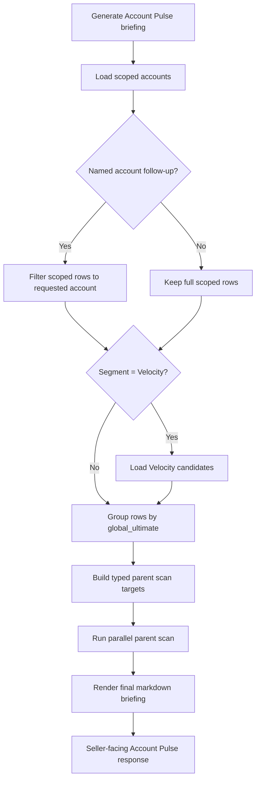
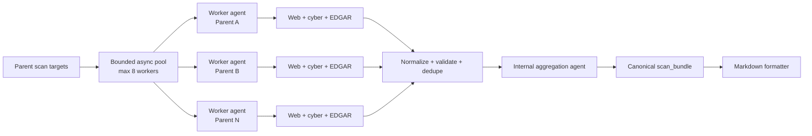
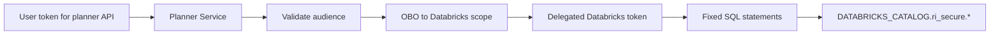

# Daily Account Planner MVP Architecture

## 1. Purpose

This MVP delivers the Daily Account Planner as a Microsoft 365 Copilot-facing
seller experience with:

- a stateful **planner service** deployed to Azure Container Apps
- a thin **M365 wrapper** exposed through a Custom Engine Agent
- Microsoft Agent Framework handoff orchestration between:
  - `DailyAccountPlanner`
  - `AccountPulse`
  - `NextMove`
- delegated **user-scoped Databricks access** using OAuth On-Behalf-Of
- planner-owned **canned SQL queries** against `${DATABRICKS_CATALOG}.ri_secure.*`

Note:

- this document describes the seeded demo architecture on `main`
- for the existing customer Databricks hosted mode, use the current operator
  documentation in:
  - [`mvp/mvp-setup-and-deployment-runbook.md`](/mnt/c/testing/veeam/revenue_intelligence/mvp/mvp-setup-and-deployment-runbook.md)
  - [`mvp/infra/README.md`](/mnt/c/testing/veeam/revenue_intelligence/mvp/infra/README.md)

The current operator deployment supports both:

- **open mode**: planner ingress is external and local direct-query validation is
  expected to work from the operator machine
- **secure mode**: planner ingress is internal, Databricks seed runs inside the
  private ACA environment, and local direct-query validation from the operator
  machine is intentionally skipped

The planner owns conversation state, orchestration, business data access, and
seller-facing behavior. The wrapper is intentionally thin and only forwards
authenticated Copilot/Bot turns into the planner API.

## 1.1 High-Level Topology

## 2. Architecture Decisions

### 2.1 Runtime split

The MVP uses two Python services:

1. **Planner service**
   - deployed to Azure Container Apps
   - owns session state, MAF handoff orchestration, Databricks OBO, and
     business-query execution
   - exposes the planner API for direct validation and wrapper forwarding

2. **M365 wrapper**
   - deployed separately to Azure Container Apps
   - surfaced to Microsoft 365 Copilot through a Custom Engine Agent
   - validates Bot/SDK traffic, acquires a planner API token for the signed-in
     user through Azure Bot OAuth or agentic auth, and forwards the turn to the
     planner service

### 2.2 Direct-query data path

The planner executes a fixed set of app-authored SQL statements against the
configured secure catalog and normalizes the results into seller-facing semantic
tool payloads. Agents stay SQL-free.

### 2.3 Planner-owned business tools

The planner owns the business operations needed by the specialist agents:

- scoped account retrieval
- ranked opportunity retrieval
- contact lookup

These operations remain typed, parameterized, and controlled by application
code rather than by generic query generation.

## 3. End-to-End Request Flow

1. A seller signs in to Microsoft 365 Copilot and opens the thin custom engine
   wrapper.
2. The wrapper receives the Bot activity at `POST /api/messages`.
3. The wrapper obtains a delegated planner API token for that signed-in user.
   - for agentic traffic, the wrapper can use Agents SDK
     `AgenticUserAuthorization`
   - for the normal installed M365/Teams path, the working live path is Azure
     Bot `UserAuthorization` against the bot OAuth connection
4. The wrapper forwards the user message and `conversation.id` to the planner
   service.
5. The planner validates the inbound bearer token for the planner API audience.
6. The planner performs OBO to Databricks using its confidential client.
7. The planner runs fixed SQL against `${DATABRICKS_CATALOG}.ri_secure.*`.
8. The planner uses Microsoft Agent Framework handoff to route the request to
   `AccountPulse` or `NextMove`.
9. `AccountPulse` or `NextMove` executes planner-owned semantic business logic,
   not SQL generation.
10. The planner returns the seller-facing reply through the wrapper to Copilot.

## 4. Planner Runtime

### 4.1 Session model

- Session store abstraction exists, but MVP storage is **in memory**
- Session identity is keyed by planner `session_id`
- Wrapper uses `conversation.id` as planner `session_id`
- Planner ACA replicas must stay pinned to `min=1`, `max=1`
- No cross-user session sharing is allowed

### 4.2 Public planner API

The planner service is the primary runtime contract:

- `POST /api/chat/sessions`
- `POST /api/chat/sessions/{session_id}/messages`
- `GET /api/chat/sessions/{session_id}`
- `GET /healthz`

The planner no longer exposes `/api/messages` as a Bot ingress.

## 5. Multi-Agent Behavior

### 5.1 Top-level planner

`DailyAccountPlanner` is the single seller-facing entry point. It decides when
to hand off to:

- `AccountPulse` for briefing, news, filings, cyber events, and "what is
  happening" requests
- `NextMove` for focus ranking, top opportunities, contact lookup, and outreach

The top-level planner should only ask a brief clarification when the user’s
intent is genuinely ambiguous.

### 5.2 Account Pulse

Account Pulse:

- remains a specialist agent in the handoff graph
- uses one planner-owned internal entry tool: `generate_account_pulse_briefing(request)`
- keeps the seller-facing contract as one briefing agent even though the work
  inside it is multi-stage

`generate_account_pulse_briefing(...)` owns the full deterministic briefing
pipeline:

1. loads the scoped account list through `get_scoped_accounts()`
2. narrows to a named account when the seller follow-up clearly asks for one
3. applies Velocity prefiltering through
   `get_top_opportunities(filter_mode="velocity_candidates")` when needed
4. groups the selected rows by `global_ultimate`
5. builds typed parent scan targets with relationship context
6. calls the internal parallel scan tool once
7. renders the final seller-facing markdown briefing

This keeps the top-level Account Pulse prompt simple and prevents the model from
returning raw intermediate JSON or drifting off the required briefing format.

#### Internal parallel scan pipeline

Account Pulse uses an internal bounded-concurrency scan engine:

- `scan_parents_parallel(scan_targets)` is the internal boundary for parent
  scanning
- work is partitioned by unique `global_ultimate` parent
- one internal worker agent flow scans one parent at a time
- the planner runs up to 8 concurrent worker flows in process
- workers use replay-aware or live source tools for:
  - general news search
  - cybersecurity search
  - EDGAR lookup
- a normalization pass deduplicates and validates worker results
- one internal aggregation agent converts worker outputs into the canonical
  `scan_bundle`
- the final markdown renderer formats the seller-facing response from that
  canonical bundle

The dynamic parallel path is feature-flagged and benchmarked against the legacy
sequential pattern before default cutover.

### 5.3 Next Move

Next Move:

- defaults to a quick ranked list
- supports deeper account guidance and email drafting
- calls `get_top_opportunities(...)`
- calls `get_account_contacts(account_id)`

## 6. Semantic Tool Contract

The planner keeps the seller-friendly tool contract:

- `get_scoped_accounts()`
- `get_top_opportunities(limit=5, offset=0, territory_override=None, filter_mode=None)`
- `get_account_contacts(account_id)`

These are planner-owned business tools backed by direct Databricks SQL.

Additionally, Account Pulse owns two internal tools that are not part of the
seller-facing shared planner contract:

- `generate_account_pulse_briefing(request, accounts=None)`
- `scan_parents_parallel(scan_targets)`

Prompts must remain SQL-free.

## 7. Databricks Access Model

### 7.1 Authentication

The planner is the Databricks trust boundary.

- inbound user token must target `api://<planner-api-app-id>`
- planner validates that token
- planner performs Databricks OBO using:
  - `PLANNER_API_CLIENT_ID`
  - `PLANNER_API_CLIENT_SECRET`
  - `DATABRICKS_OBO_SCOPE=2ff814a6-3304-4ab8-85cb-cd0e6f879c1d/.default`

The wrapper does **not** mint or forward Databricks tokens directly.

### 7.2 Query execution

The planner uses the Databricks SQL Statements API with fixed application-owned
queries against the configured secure catalog:

- `${DATABRICKS_CATALOG}.ri_secure.accounts`
- `${DATABRICKS_CATALOG}.ri_secure.reps`
- `${DATABRICKS_CATALOG}.ri_secure.opportunities`
- `${DATABRICKS_CATALOG}.ri_secure.contacts`

The planner normalizes result sets into the typed tool payloads expected by the
agents.

### 7.3 Seeded demo data

The MVP keeps synthetic but enriched RI data in the real Databricks workspace so
the behavior is realistic enough to validate:

- customer vs prospect context
- parent/subsidiary relationships
- renewal-aware nudges
- upsell and multi-play opportunities
- no-play and no-contact cases
- stale-contact cases
- ENT / COM / VEL differences

The access-control demo is intentionally a **two-user** model. The seeded
entitlements and grants are rendered for the operator-supplied:

- `SELLER_A_UPN`
- `SELLER_B_UPN`

## 8. M365 Wrapper

The thin wrapper exists only to surface the planner in M365 Copilot.

Responsibilities:

- expose `POST /api/messages`
- receive Bot / Custom Engine requests
- resolve the signed-in user’s planner API token through the Agents SDK auth layer
  - non-agentic M365 traffic uses Azure Bot `UserAuthorization` against a bot
    OAuth connection on the bot app itself
  - agentic traffic can still use `AgenticUserAuthorization` when available
- forward the text and conversation ID to the planner service
- remain stateless and orchestration-free
- allow Bot Framework sign-in invoke callbacks to complete without sending a
  seller-facing message
- own the wrapper-side long-running turn behavior:
  - no visible acknowledgement for fast turns
  - delayed generic acknowledgement after the configured threshold
  - busy rejection for overlapping turns in the same conversation
  - proactive continuation back into the same conversation for the final reply

Reusable wrapper pattern:

- most of this wrapper shape is reusable for other M365 agentic deployments
- the reusable pieces are:
  - Bot and Agents SDK bootstrap
  - auth handler wiring
  - conversation-to-session mapping
  - long-running turn handling
  - busy gating
  - seller-safe fallback messaging
- the main service-specific pieces are:
  - the downstream HTTP client
  - payload translation between Bot activities and the target service API
  - target scopes, app IDs, and telemetry labels

Current implementation note:

- the wrapper carries a local compatibility bridge for the Python Microsoft
  Agents SDK long-running proactive path so the original user message contract
  is preserved when the wrapper resumes the turn through proactive continuation

Local note:

- direct shell calls to the wrapper cannot fully simulate Copilot ingress because
  `/api/messages` expects a Bot or channel-issued bearer token for the bot app
  audience
- local wrapper verification therefore has two layers:
  - service-local forwarding tests
  - channel-local validation through Agents Playground / Azure Bot

The wrapper must not:

- call Databricks
- own planner state
- duplicate planner orchestration logic

M365 packaging requirements:

- the Teams/M365 app package must include `webApplicationInfo`
- `webApplicationInfo.id` should be the bot Entra app ID
- `webApplicationInfo.resource` should use the bot SSO Application ID URI,
  typically `api://botid-<bot-app-id>`
- `token.botframework.com` must be included in `validDomains`
- the current MVP package uses `functionsAs=agentOnly`

## 9. Configuration Contract

### 9.1 Planner service

Required runtime variables:

- `AZURE_TENANT_ID`
- `AZURE_OPENAI_ENDPOINT`
- `AZURE_OPENAI_DEPLOYMENT`
- `PLANNER_API_CLIENT_ID`
- `PLANNER_API_CLIENT_SECRET`
- `PLANNER_API_EXPECTED_AUDIENCE`
- `DATABRICKS_HOST`
- `DATABRICKS_OBO_SCOPE`
- `SESSION_STORE_MODE=memory`
- `SESSION_MAX_TURNS`

Runtime variables commonly generated or backfilled by the bootstrap:

- `DATABRICKS_WAREHOUSE_ID`
- `DATABRICKS_AUTO_CREATE_WAREHOUSE`
- `DATABRICKS_WAREHOUSE_NAME`
- `DATABRICKS_WAREHOUSE_CLUSTER_SIZE`
- `DATABRICKS_WAREHOUSE_MIN_NUM_CLUSTERS`
- `DATABRICKS_WAREHOUSE_MAX_NUM_CLUSTERS`
- `DATABRICKS_WAREHOUSE_AUTO_STOP_MINS`
- `DATABRICKS_WAREHOUSE_TYPE`

Optional development-only variables:

- `RI_SCOPE_MODE`
- `RI_DEMO_TERRITORY`
- `DATABRICKS_PAT`
- `PLANNER_API_BEARER_TOKEN`
- `ACCOUNT_PULSE_EXECUTION_MODE`
- `ACCOUNT_PULSE_MAX_CONCURRENCY`
- `ACCOUNT_PULSE_SOURCE_MODE`
- `ACCOUNT_PULSE_REPLAY_FIXTURE_SET`
- `ACCOUNT_PULSE_ENABLE_INTERNAL_AGGREGATOR`

### 9.2 Wrapper

Required runtime variables:

- `AZURE_TENANT_ID`
- `BOT_APP_ID`
- `BOT_APP_PASSWORD`
- `BOT_SSO_APP_ID` (normally the same app registration as `BOT_APP_ID`)
- `BOT_SSO_RESOURCE`
- `BOT_RESOURCE_NAME`
- `PLANNER_SERVICE_BASE_URL`
- `PLANNER_API_SCOPE`
- `AZUREBOTOAUTHCONNECTIONNAME`
- `M365_AUTH_HANDLER_ID`
- `WRAPPER_FORWARD_TIMEOUT_SECONDS`

Optional wrapper variables:

- `OBOCONNECTIONNAME`
  - reserved for agentic or future alternate auth flows
  - not required for the current live non-agentic M365 sign-in path

### 9.3 ACA deployment

- `ACA_ENVIRONMENT_NAME`
- `PLANNER_ACA_APP_NAME`
- `WRAPPER_ACA_APP_NAME`
- `ACA_MIN_REPLICAS=1`
- `ACA_MAX_REPLICAS=1`
- `PLANNER_API_IMAGE`
- `WRAPPER_IMAGE`

Optional CLI publish variables:

- `M365_GRAPH_PUBLISHER_CLIENT_ID`

## 10. Deployment Sequence

The recommended operator flow is now a **two-step bootstrap**, not a manual
script-by-script sequence:

1. Fill the small operator-owned input env:
   - `mvp/.env.inputs` for open mode
   - `mvp/.env.secure.inputs` for secure mode
2. Run Azure bootstrap:
   - `bash mvp/infra/scripts/bootstrap-azure-demo.sh open|secure`
3. Run M365 bootstrap:
   - `bash mvp/infra/scripts/bootstrap-m365-demo.sh open|secure`

What the Azure bootstrap now owns:

- runtime env generation from the operator input env
- foundation reuse or deployment
- planner and wrapper image build/publish
- app registration create/reuse with persisted app IDs/object IDs
- mandatory admin-consent gating for the operator path
- planner deployment
- secure or open Databricks seeding
- secure seed-job execution for private mode
- wrapper deployment
- Azure Bot resource and OAuth connection updates

What the M365 bootstrap now owns:

- Teams/M365 package build
- catalog publish through Graph
- self-install for the signed-in operator

Operational behavior that now matters for repeatability:

- the operator edits only `*.inputs`
- `.env` and `.env.secure` are script-owned generated runtime files
- runtime files preserve generated values only when the bootstrap input
  signature still matches the same tenant/subscription/prefix/user set
- missing admin consent is a blocking failure for the operator bootstrap
- when no Databricks SQL warehouse exists, the bootstrap can create one
  automatically instead of failing late

## 11. Test Strategy

### 11.1 Unit tests

- inbound planner token validation
- Databricks OBO acquisition
- direct SQL execution helper behavior
- semantic tool payload stability
- session creation and isolation
- planner routing and handoff behavior
- Account Pulse account narrowing and formatter behavior
- parallel scan worker validation, dedupe, and concurrency cap behavior

### 11.2 Integration tests

- direct planner chat flow
- wrapper forwarding to planner
- real Databricks seeded data visibility
- user-scoped delegated data access through planner
- multi-turn Account Pulse behavior, including follow-up briefing on one named
  account from a prior briefing
- replay-backed Account Pulse benchmark comparisons between sequential and
  dynamic parallel execution

### 11.3 Acceptance milestones

Focused execution milestones for this MVP are:

1. **Direct Databricks OBO path**
   - planner validates user token
   - planner acquires Databricks delegated token
   - fixed secure-view queries succeed

2. **Local end-to-end**
   - planner direct API is validated with a real delegated user token
   - wrapper forwarding behavior is validated locally at service level
   - channel ingress is validated separately through Agents Playground / Azure Bot
   - Account Pulse multi-turn briefing flow is validated locally

3. **Azure Container Apps**
   - planner and wrapper both deploy cleanly
   - planner remains single replica for in-memory sessions

4. **Thin M365 deployment**
   - Azure Bot points to wrapper
   - Custom Engine Agent forwards turns unchanged
   - first-turn sign-in and token exchange succeed
   - seller sees Account Pulse and Next Move through Copilot

## 12. Main Implementation Notes

- Direct canned queries are the correct phase-1 path because the planner needs
  a small fixed set of business operations, not dynamic SQL generation.
- The semantic tool contract stays stable even if the transport or SQL
  implementation evolves later.
- Account Pulse now uses a deterministic planner-owned briefing pipeline rather
  than relying on the specialist model to manually chain all intermediate tools.
- Account Pulse follow-up prompts that name one account should narrow to that
  account while preserving parent-company signal context.
- The Account Pulse parallel scan engine is intentionally internal to the
  planner runtime so the handoff graph stays simple: `DailyAccountPlanner` ->
  `AccountPulse` or `NextMove`.
- `PLANNER_API_CLIENT_ID` and `PLANNER_API_CLIENT_SECRET` remain required
  because Databricks OBO is performed by the planner service.
- The current Teams/M365 package uses `functionsAs=agentOnly`; moving to an
  agentic-user template path later would require `agenticUserTemplateId` in the
  package schema.
