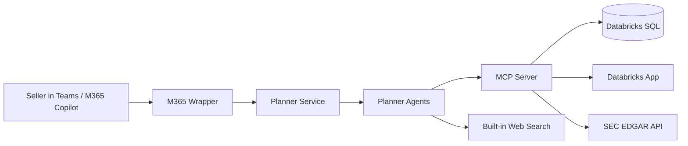

# MCP-First Architecture Design

## Purpose

This document captures the architecture design for the `mcp-dev` branch and the
new requirement set behind it.

The central design goal is:

- agent developers should not need to know anything about data-source-specific
  authentication, connection setup, SQL execution, Databricks App calling
  patterns, public-source API quirks, or backend selection

Instead, agent developers should have:

- a stable semantic MCP tool surface
- a standardized way to authenticate to and call MCP for organization-managed
  external tools
- no direct source-specific implementation path outside MCP for those tools

This document is intentionally more requirement-traceable than the broader
architecture overview in
[daily-account-planner-architecture.md](/mnt/c/testing/veeam/revenue_intelligence/mvp/daily-account-planner-architecture.md).

## Design Principles

1. The planner owns conversation state, orchestration, and seller-facing UX.
2. MCP owns organization-managed tool execution.
3. Source-specific auth and transport live behind MCP, not in planner agents.
4. Semantic tool names stay stable even if backends change.
5. End-user streaming matters at the planner and wrapper layers, not at the MCP
   protocol layer.
6. The architecture should support a path from secret-based hosted auth to
   managed-identity-based hosted auth.

## Requirements

### R1. Agent developers must be insulated from source-specific auth and connection logic

Agent developers should not deal with:

- Databricks OBO
- SQL warehouse selection
- Databricks App auth
- SEC EDGAR HTTP handling
- REST endpoint specifics for source systems
- source-specific network behavior

They should only access organization-managed external tools through MCP, either
by:

- direct MCP tool binding in agent definitions
- low-level MCP calls inside deterministic planner orchestration code

### R2. MCP is the only shared external tool path on this branch

There should be no `PLANNER_TOOL_RUNTIME` direct fallback and no planner-owned
runtime path that directly reaches shared external sources that belong behind
the MCP boundary.

### R3. All source-specific logic must move to MCP

Databricks SQL logic, Databricks App integration, downstream token exchange,
backend routing, SEC EDGAR calling logic, and source-specific normalization
must live in `mvp/mcp_server/`.

### R4. The planner and internal-agent tool vocabulary must stay stable

The planner should continue exposing the seller-facing semantic tools:

- `get_scoped_accounts`
- `lookup_rep`
- `get_top_opportunities`
- `get_account_contacts`

Internal agents should also get shared research tools from MCP rather than from
local source-specific modules:

- `edgar_lookup`

The planner and internal agent prompt/tool surfaces should not change just
because the backend moves.

### R5. Backend variety must be demonstrated

At least one tool should be backed by a Databricks App while other tools remain
SQL-backed, so the branch demonstrates that MCP can hide backend diversity.

### R6. Local development should optimize for planner + MCP inner loop

Developers should be able to:

- run planner locally
- point planner to a remote or local MCP server
- use a simple local chat UI
- avoid using Teams/Copilot as the only iteration loop

### R7. Streaming focus should be on end-user UX, not MCP transport

The planner and wrapper should move toward in-turn and streamed responses where
feasible, while MCP remains a request/response tool boundary.

### R8. The hosted auth model should have a clear path to fewer secrets

The architecture should support:

- removal of `BOT_APP_PASSWORD` from the wrapper path
- removal of `MCP_CLIENT_SECRET` from the MCP path through managed-identity
  federation and client assertion

## Target Architecture

## Component Responsibilities

### M365 wrapper

The wrapper is intentionally thin.

Responsibilities:

- receive Bot / M365 activities
- acquire or forward the signed-in user context for planner access
- forward turns to planner
- prefer in-turn completion when possible
- use long-running completion only when the planner crosses the threshold

Non-responsibilities:

- no enterprise data access
- no Databricks auth
- no tool-specific logic

### Planner service

The planner is the seller-facing runtime.

Responsibilities:

- session state
- agent orchestration and handoff
- seller-facing prompts and response formatting
- streaming SSE endpoint for local/dev
- wrapper-facing request handling
- semantic MCP tool invocation

Non-responsibilities:

- no direct Databricks SQL execution
- no direct downstream OBO to enterprise data sources
- no source-specific connection logic

### MCP server

The MCP server is the shared external tool execution boundary.

Responsibilities:

- validate caller identity at the MCP boundary
- own downstream delegated token exchange where required
- choose backend per tool
- own source-specific clients and transport
- normalize backend payloads to semantic tool contracts
- hide SQL, app endpoints, public API details, and source auth details from
  agent developers

### Databricks SQL backend

Current SQL-backed tools:

- `get_scoped_accounts`
- `lookup_rep`
- `get_account_contacts`

### Databricks App backend

Current app-backed tool:

- `get_top_opportunities`

This tool is intentionally routed through the Databricks App showcase path so
the architecture demonstrates that semantic tools are not tied to one backend
type.

### Public source backend

Current shared public-source tool:

- `edgar_lookup`

This tool does not require downstream enterprise authentication, but it still
belongs behind MCP because the planner should not own SEC-specific calling,
normalization, rate limiting, or caching behavior.

## Planner Developer Surface

The intended stable surface is the MCP server itself.

Agent developers should not hand-define duplicate planner-side MCP tool
schemas when the framework can bind MCP tools directly. The MCP server is the
source of truth for:

- tool names
- descriptions
- parameter schemas
- backend routing

Planner-side code should only contain:

- MCP connection/auth glue
- deterministic orchestration code that calls MCP programmatically when the
  planner runtime needs tool results inside Python control flow

In the current branch, that glue lives in:

- [auth_context.py](/mnt/c/testing/veeam/revenue_intelligence/mvp/agents/auth_context.py)
- [config.py](/mnt/c/testing/veeam/revenue_intelligence/mvp/agents/config.py)
- direct `MCPStreamableHTTPTool` usage inside planner agents and deterministic orchestration code

This means the planner-side layer is not a duplicate tool definition surface.
It is only minimal transport/auth glue for reaching the MCP-owned contract.

## Authentication Boundary

### Planner-side auth

The planner only authenticates:

- inbound planner API callers
- planner-to-MCP access using the signed-in user bearer token

Planner auth code lives in:

- [auth_context.py](/mnt/c/testing/veeam/revenue_intelligence/mvp/agents/auth_context.py)

This planner auth layer does not own Databricks OBO anymore.

### MCP-side auth

MCP owns downstream source authentication and connection behavior.

Current implementation supports:

- secret-based delegated OBO using `MCP_CLIENT_SECRET`
- managed-identity assertion mode using
  `OnBehalfOfCredential(..., client_assertion_func=...)`

Per-tool behavior can differ behind the same MCP boundary:

- Databricks-backed tools require delegated downstream enterprise auth
- `edgar_lookup` does not require downstream enterprise auth
- planner agents do not need to care which model applies

MCP auth code lives in:

- [auth_context.py](/mnt/c/testing/veeam/revenue_intelligence/mvp/mcp_server/auth_context.py)

This is the key requirement boundary: source-specific delegated auth happens
here, not in planner agents.

## Tool Routing Model

The planner does not choose a source-specific client. It calls a semantic tool.
The MCP server maps the tool to a backend.

Current routing model:

- `get_scoped_accounts` -> Databricks SQL
- `lookup_rep` -> Databricks SQL
- `get_account_contacts` -> Databricks SQL
- `get_top_opportunities` -> Databricks App
- `edgar_lookup` -> SEC EDGAR API

This routing is owned by MCP and can evolve without changing planner prompts or
agent code.

## Streaming and User Experience

### Planner API

The planner exposes:

- `POST /api/chat/sessions/{session_id}/messages/stream`

This SSE endpoint is intended for:

- local developer testing
- debugging
- future wrapper-side streamed UX where channel behavior allows it

### MCP

MCP is not being used as a user-facing streaming layer. In this design:

- MCP is a tool boundary
- planner/wrapper own end-user streaming
- MCP remains request/response oriented

### Wrapper

The wrapper should continue using the in-turn-first pattern:

1. receive the turn normally
2. wait inline for a short threshold
3. if the result is fast, reply in-turn
4. if the result is slow, acknowledge and complete later only when needed

## Local Development Model

The intended inner loop is:

1. run planner locally
2. run dev UI locally
3. point planner at a local or dev MCP server
4. exercise streamed conversations without going through Teams/Copilot

Relevant files:

- [api.py](/mnt/c/testing/veeam/revenue_intelligence/mvp/agents/api.py)
- [app.py](/mnt/c/testing/veeam/revenue_intelligence/mvp/dev_ui/app.py)
- [docker-compose.yml](/mnt/c/testing/veeam/revenue_intelligence/mvp/docker-compose.yml)

## Branch Layout

The `mcp-dev` design keeps the work inside `mvp/`:

- `mvp/agents/`
- `mvp/mcp_server/`
- `mvp/databricks_apps/top_opportunities_app/`
- `mvp/dev_ui/`

This keeps the new architecture parallel to the existing MVP structure without
creating a second top-level application tree.

## Requirement Coverage

### Implemented

`R1` Agent developers insulated from source-specific auth and connection logic

- planner agents now bind directly to MCP-loaded tools where the framework
  allows it
- planner-side Databricks execution logic has been removed from the active path
- planner-side EDGAR implementation logic has been removed from the live path
- MCP owns downstream auth and backend execution

`R2` MCP is the only shared external tool path on this branch

- planner semantic tools route through MCP
- internal shared research tools also route through MCP in live mode
- no planner runtime direct tool fallback is retained

`R3` All source-specific logic moved to MCP

- source-specific modules now live under `mvp/mcp_server/`
- planner-side orchestration code can still call MCP programmatically, but it
  does not implement source-specific backend behavior

`R4` Stable planner and internal-agent tool vocabulary

- the same four seller-facing semantic tool names remain available
- `edgar_lookup` is now MCP-owned for internal scan workers as well

`R5` Backend variety demonstrated

- `get_top_opportunities` is app-backed
- several tools are SQL-backed
- `edgar_lookup` demonstrates a shared public API backend behind MCP

`R6` Local development optimized for planner + MCP inner loop

- planner SSE endpoint exists
- dev UI exists
- compose scaffolding exists

`R7` Streaming focused on end-user UX

- planner streaming exists
- wrapper streaming support exists
- MCP is not treated as the user streaming layer

### Partially Implemented

`R8` Path to fewer secrets

Implemented in code:

- planner no longer owns downstream Databricks OBO
- MCP auth code supports managed-identity assertion mode

Still pending in deployment/bootstrap:

- wrapper hosted path still assumes `BOT_APP_PASSWORD`
- bootstrap/deploy scripts still persist secret-based settings
- MCP managed-identity trust still needs full deployment wiring

## Explicit Non-Goals

These are not goals of this branch design:

- using MCP for built-in tools like web search
- allowing planner agents to author arbitrary SQL
- exposing source-specific parameters in planner prompts
- making Teams/Copilot the only development/test loop

## Remaining Gaps

The main remaining architecture-to-operations gaps are in deployment wiring:

1. Wrapper deployment still expects `BOT_APP_PASSWORD`.
2. MCP deployment/bootstrap still needs managed-identity trust provisioning.
3. Env examples still include some legacy planner-secret-era variables for
   transition and compatibility.
4. Older documentation outside this file may still describe the previous
   planner-owned Databricks path.

## Bottom Line

The `mcp-dev` branch design now matches the core requirement:

- planner agents use a standardized semantic tool surface loaded from MCP
- MCP owns source-specific authentication and connectivity where required
- MCP also owns shared public-source integrations that should not live in
  planner code
- backend choice is hidden behind MCP
- streaming work is focused at the planner and wrapper UX layers

The biggest remaining work is no longer architecture definition. It is hosted
deployment and bootstrap completion for the secretless managed-identity path.
