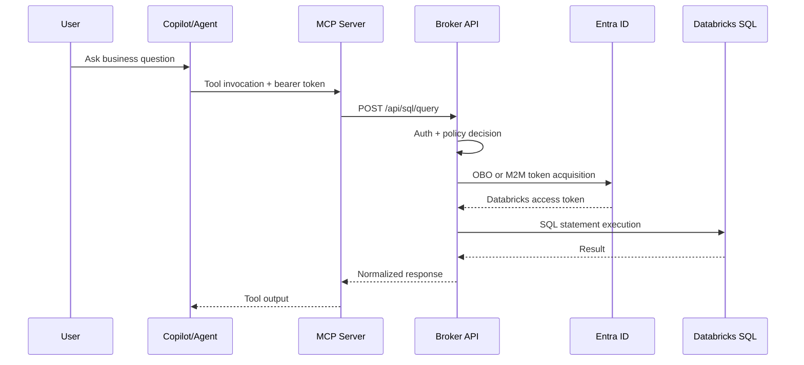
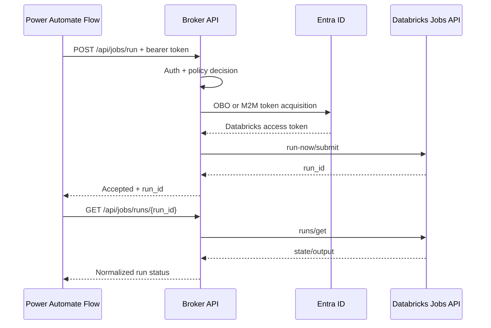

# Azure Databricks Broker Platform Architecture

## Architecture Design Document

**Version:** 1.0  
**Date:** March 6, 2026  
**Status:** Proposed

---

## 1. Executive Summary

This document defines the **broker-first architecture** for integrating enterprise clients with Azure Databricks across a rich capability set:

- Databricks SQL
- Databricks Jobs
- Databricks Model Serving
- Databricks Apps
- Databricks built-in MCP surfaces (where applicable)

The broker is the stable identity, policy, and execution boundary. **MCP remains a capability channel for AI agents**, not the universal adapter for every Databricks integration path.

---

## 2. Design Intent

### 2.1 Core Position

- The **Broker Platform** is the long-lived integration backbone.
- **MCP is one channel** (agent protocol and tool contract), alongside direct REST channels (Power Platform, custom APIs, backend workloads).
- Databricks is the execution and intelligence plane for data/ML workloads.

### 2.2 Why this design

This design addresses scale and governance concerns by avoiding client-by-client Databricks token handling and by centralizing:

- token exchange and lifecycle controls,
- authorization policy enforcement,
- audit and observability,
- capability routing across SQL/Jobs/Serving/Apps.

---

## 3. Goals and Non-Goals

### 3.1 Goals

- Support multiple caller channels with one identity and policy boundary.
- Provide first-class support for Databricks SQL, Jobs, Model Serving, and Apps.
- Keep MCP focused on agent interoperability and orchestration.
- Minimize repeated auth implementation in MCP, Power Platform, and custom services.
- Preserve Unity Catalog and Databricks-native authorization where appropriate.

### 3.2 Non-Goals

- Turning MCP into the primary execution runtime for all workloads.
- Replacing Databricks governance with custom broker-only authorization.
- Exposing raw generic Databricks proxy endpoints without policy controls.

---

## 4. Logical Architecture

```mermaid
graph TB
    subgraph Clients[Client Channels]
        Copilot[Copilot / Agent Clients]
        PP[Power Platform Flows]
        Custom[Custom Apps / APIs]
    end

    subgraph Channel[Channel Layer]
        MCP[MCP Server<br/>Agent Tools & Routing]
        Direct[Direct REST Consumers]
    end

    subgraph Platform[Broker Platform]
        API[Broker API Surface<br/>SQL Jobs Serving Apps]
        Auth[Identity & Token Service<br/>OBO + M2M]
        Policy[Policy Decision Layer<br/>Caller User Action]
        Obs[Audit Telemetry Correlation]
    end

    subgraph DataAI[Databricks Capability Plane]
        SQL[SQL Warehouses<br/>Statement API]
        Jobs[Jobs API]
        Serving[Model Serving API]
        Apps[Databricks Apps / Related APIs]
        UC[Unity Catalog]
    end

    Entra[Microsoft Entra ID]

    Copilot --> MCP
    MCP --> API

    PP --> Direct
    Custom --> Direct
    Direct --> API

    API --> Auth
    API --> Policy
    API --> Obs

    Auth --> Entra

    API --> SQL
    API --> Jobs
    API --> Serving
    API --> Apps

    SQL --> UC
    Jobs --> UC
    Serving --> UC

    style API fill:#E17055,color:#fff
    style MCP fill:#FDCB6E,color:#000
    style Entra fill:#00B894,color:#fff
    style SQL fill:#FF7675,color:#fff
    style UC fill:#55A3E8,color:#fff
```

---

## 5. Interaction Modes

### 5.1 Agent Mode (MCP Channel)

- Client calls MCP tools.
- MCP performs tool-level orchestration and delegates execution to Broker APIs.
- Broker performs auth, policy, token handling, and Databricks API execution.

### 5.2 Non-Agent Mode (Direct REST Channel)

- Power Platform flows and custom apps call Broker APIs directly.
- No MCP dependency required.
- Same policy and audit model as Agent Mode.

---

## 6. Capability Routing Model

| Capability | Broker Endpoint Family | Databricks Surface |
|---|---|---|
| SQL query execution | `/api/sql/*` | SQL Statement Execution API |
| Job orchestration | `/api/jobs/*` | Jobs API |
| Inference invocation | `/api/serving/*` | Model Serving API |
| App interactions | `/api/apps/*` | Databricks Apps-related APIs |
| Agent tools | MCP tool contracts mapping to `/api/*` | Any of the above |

**Design rule:** MCP tools map to broker business endpoints, not directly to raw Databricks tokens or unconstrained proxy calls.

---

## 7. Identity and Token Strategy

### 7.1 Entry Token

All callers authenticate with Entra ID to broker-protected audiences/scopes.

### 7.2 Broker Downstream Modes

- **OBO mode:** preserve delegated user context for workloads requiring user-context enforcement.
- **M2M mode:** service principal execution for controlled backend/asynchronous workloads.

### 7.3 Selection Policy

Mode is selected by policy based on:

- caller channel,
- capability/action,
- data sensitivity,
- execution pattern (sync vs async),
- compliance requirements.

---

## 8. Authorization and Policy Model

Policy decision inputs:

- Caller identity (application/workload)
- User identity (when delegated)
- Requested capability and action
- Resource target (warehouse, job, serving endpoint, app)
- Parameter profile

Policy outcomes:

- Allow/deny
- OBO vs M2M mode
- Allowed target resources
- Parameter constraints and result limits

---

## 9. Security Controls

- Strict JWT validation (issuer, audience, tenant, expiry, signature).
- Capability allowlists and resource-level allowlists.
- Input schema validation and parameter constraints.
- No raw Databricks token return to external callers.
- Secret/certificate storage in Key Vault.
- End-to-end correlation IDs and security/audit events.

---

## 10. Reliability and Operations

- Centralized retry and timeout behavior per capability.
- Async submit/poll model for long-running Jobs operations.
- Idempotency keys for safe retried requests.
- Standardized broker error contracts for Copilot and Power Platform.
- SLOs and alerts for auth failures, policy denials, latency, and Databricks API errors.

---

## 11. APIM Positioning

APIM is optional for POC but recommended for production governance.

When enabled:

- APIM fronts Broker APIs for productization, quotas, and lifecycle controls.
- MCP may be exposed directly or through APIM depending on ingress policy strategy.

---

## 12. Reference Flows

### 12.1 Agent SQL Flow

### 12.2 Power Platform Jobs Flow

---

## 13. MCP Role

MCP is a first-class capability for agent ecosystems, providing:

- tool discovery and invocation contracts,
- conversation-aligned orchestration,
- lightweight transformation of broker responses.

MCP is **not required** for non-agent channels and is **not the sole Databricks integration boundary**.

---

## 14. Implementation Phasing

### Phase 1 (Current Baseline)

- MCP → Broker token exchange for SQL workflow.
- Databricks SQL execution integrated.

### Phase 2

- Broker business REST endpoints for SQL and Jobs.
- MCP tools switched to broker business endpoints instead of direct SQL connector usage.
- Power Platform direct broker integration.

### Phase 3

- Add Model Serving and Apps endpoint families.
- Add policy-driven OBO/M2M mode selection per action.

### Phase 4

- Optional APIM front door for full productization and governance.

---

## 15. Architecture Decision Summary

- Broker is the durable identity/policy/execution boundary.
- MCP is a channel capability for agents, not a universal adapter requirement.
- Databricks remains the computation and intelligence plane.
- The platform scales by adding capabilities behind broker APIs while preserving stable client contracts.
